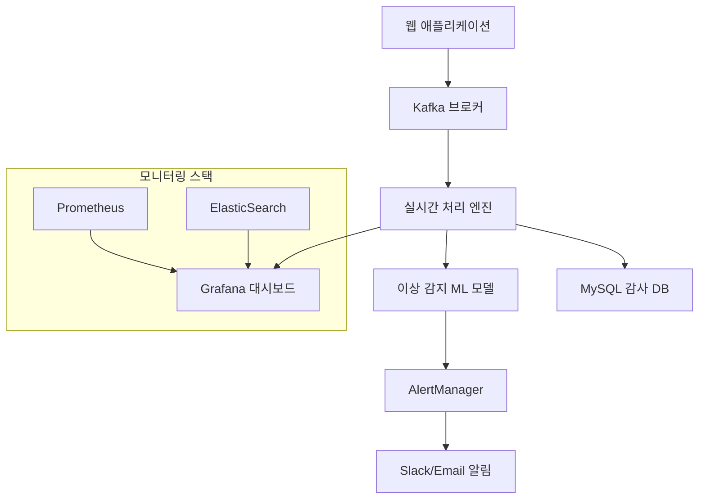

# 고급 구현 프로젝트 (Phase 6)

## 개요
실제 운영 환경에서 활용할 수 있는 고급 모니터링 시스템 구현 프로젝트들을 통해 종합적인 모니터링 역량을 완성합니다.

## 1. 실시간 로그인 실패 감지 시스템

### 1.1 시스템 아키텍처



### 1.2 Spring Boot 애플리케이션 구현

**로그인 실패 이벤트 생성**
```java
// LoginFailureDetectionApplication.java
@SpringBootApplication
@EnableJpaAuditing
public class LoginFailureDetectionApplication {
    public static void main(String[] args) {
        SpringApplication.run(LoginFailureDetectionApplication.class, args);
    }
}

// AuthenticationService.java
@Service
@Slf4j
public class AuthenticationService {
    
    private final UserRepository userRepository;
    private final LoginAttemptRepository attemptRepository;
    private final SecurityEventPublisher eventPublisher;
    private final Counter loginAttempts;
    private final Counter loginFailures;
    private final Timer loginDuration;
    
    public AuthenticationService(UserRepository userRepository,
                               LoginAttemptRepository attemptRepository,
                               SecurityEventPublisher eventPublisher,
                               MeterRegistry meterRegistry) {
        this.userRepository = userRepository;
        this.attemptRepository = attemptRepository;
        this.eventPublisher = eventPublisher;
        
        // Prometheus 메트릭 초기화
        this.loginAttempts = Counter.builder("login_attempts_total")
                .description("Total login attempts")
                .tag("result", "unknown")
                .register(meterRegistry);
        
        this.loginFailures = Counter.builder("login_failures_total")
                .description("Total login failures")
                .tag("reason", "unknown")
                .register(meterRegistry);
        
        this.loginDuration = Timer.builder("login_duration_seconds")
                .description("Login attempt duration")
                .register(meterRegistry);
    }
    
    public AuthenticationResult authenticate(LoginRequest request, HttpServletRequest httpRequest) {
        Timer.Sample sample = Timer.start();
        
        try {
            // 로그인 시도 정보 수집
            LoginAttempt attempt = createLoginAttempt(request, httpRequest);
            
            // 사용자 인증
            Optional<User> user = userRepository.findByUsername(request.getUsername());
            
            if (user.isEmpty()) {
                return handleAuthenticationFailure(attempt, "USER_NOT_FOUND", sample);
            }
            
            if (!passwordEncoder.matches(request.getPassword(), user.get().getPasswordHash())) {
                return handleAuthenticationFailure(attempt, "INVALID_PASSWORD", sample);
            }
            
            // 계정 상태 확인
            if (!user.get().isEnabled()) {
                return handleAuthenticationFailure(attempt, "ACCOUNT_DISABLED", sample);
            }
            
            if (user.get().isLocked()) {
                return handleAuthenticationFailure(attempt, "ACCOUNT_LOCKED", sample);
            }
            
            // 성공적인 로그인
            return handleAuthenticationSuccess(attempt, user.get(), sample);
            
        } catch (Exception e) {
            log.error("Authentication error", e);
            return handleAuthenticationFailure(attempt, "SYSTEM_ERROR", sample);
        }
    }
    
    private LoginAttempt createLoginAttempt(LoginRequest request, HttpServletRequest httpRequest) {
        String clientIp = getClientIpAddress(httpRequest);
        String userAgent = httpRequest.getHeader("User-Agent");
        String sessionId = httpRequest.getSession().getId();
        
        return LoginAttempt.builder()
                .username(request.getUsername())
                .clientIp(clientIp)
                .userAgent(userAgent)
                .sessionId(sessionId)
                .attemptTime(Instant.now())
                .success(false)
                .build();
    }
    
    private AuthenticationResult handleAuthenticationFailure(LoginAttempt attempt, 
                                                           String reason, 
                                                           Timer.Sample sample) {
        attempt.setSuccess(false);
        attempt.setFailureReason(reason);
        attemptRepository.save(attempt);
        
        // 메트릭 업데이트
        loginAttempts.increment(Tags.of("result", "failure"));
        loginFailures.increment(Tags.of("reason", reason));
        sample.stop(loginDuration.tag("result", "failure"));
        
        // 실시간 이벤트 발행
        SecurityEvent event = SecurityEvent.builder()
                .eventType("LOGIN_FAILURE")
                .timestamp(Instant.now())
                .sourceIp(attempt.getClientIp())
                .username(attempt.getUsername())
                .reason(reason)
                .userAgent(attempt.getUserAgent())
                .sessionId(attempt.getSessionId())
                .build();
        
        eventPublisher.publishSecurityEvent(event);
        
        // 로그 기록 (구조화된 형태)
        log.warn("Login failure: username={}, ip={}, reason={}, userAgent={}", 
                attempt.getUsername(), attempt.getClientIp(), reason, attempt.getUserAgent());
        
        return AuthenticationResult.failure(reason);
    }
    
    private AuthenticationResult handleAuthenticationSuccess(LoginAttempt attempt, 
                                                          User user, 
                                                          Timer.Sample sample) {
        attempt.setSuccess(true);
        attempt.setUserId(user.getId());
        attemptRepository.save(attempt);
        
        // 메트릭 업데이트
        loginAttempts.increment(Tags.of("result", "success"));
        sample.stop(loginDuration.tag("result", "success"));
        
        // 사용자 로그인 시간 업데이트
        user.setLastLoginTime(Instant.now());
        user.setLastLoginIp(attempt.getClientIp());
        userRepository.save(user);
        
        // 성공 이벤트 발행
        SecurityEvent event = SecurityEvent.builder()
                .eventType("LOGIN_SUCCESS")
                .timestamp(Instant.now())
                .sourceIp(attempt.getClientIp())
                .username(attempt.getUsername())
                .userId(user.getId())
                .userAgent(attempt.getUserAgent())
                .sessionId(attempt.getSessionId())
                .build();
        
        eventPublisher.publishSecurityEvent(event);
        
        log.info("Login success: username={}, ip={}, userId={}", 
                attempt.getUsername(), attempt.getClientIp(), user.getId());
        
        return AuthenticationResult.success(user);
    }
    
    private String getClientIpAddress(HttpServletRequest request) {
        String xForwardedFor = request.getHeader("X-Forwarded-For");
        if (xForwardedFor != null && !xForwardedFor.isEmpty()) {
            return xForwardedFor.split(",")[0].trim();
        }
        
        String xRealIp = request.getHeader("X-Real-IP");
        if (xRealIp != null && !xRealIp.isEmpty()) {
            return xRealIp;
        }
        
        return request.getRemoteAddr();
    }
}

// SecurityEventPublisher.java
@Component
@Slf4j
public class SecurityEventPublisher {
    
    private final KafkaTemplate<String, SecurityEvent> kafkaTemplate;
    
    @Value("${security.events.topic:security-events}")
    private String securityEventsTopic;
    
    public SecurityEventPublisher(KafkaTemplate<String, SecurityEvent> kafkaTemplate) {
        this.kafkaTemplate = kafkaTemplate;
    }
    
    @Async
    public void publishSecurityEvent(SecurityEvent event) {
        try {
            String key = event.getSourceIp() + ":" + event.getUsername();
            
            kafkaTemplate.send(securityEventsTopic, key, event)
                    .addCallback(
                        result -> log.debug("Security event sent: {}", event.getEventType()),
                        failure -> log.error("Failed to send security event", failure)
                    );
                    
        } catch (Exception e) {
            log.error("Error publishing security event", e);
        }
    }
}
```

### 1.3 Kafka 기반 실시간 이벤트 스트리밍

**Kafka 설정**
```yaml
# kafka-config.yml
apiVersion: kafka.strimzi.io/v1beta2
kind: Kafka
metadata:
  name: security-events-cluster
  namespace: monitoring
spec:
  kafka:
    version: 3.6.0
    replicas: 3
    listeners:
      - name: plain
        port: 9092
        type: internal
        tls: false
      - name: tls
        port: 9093
        type: internal
        tls: true
    config:
      offsets.topic.replication.factor: 3
      transaction.state.log.replication.factor: 3
      transaction.state.log.min.isr: 2
      default.replication.factor: 3
      min.insync.replicas: 2
      log.retention.hours: 168
      log.segment.bytes: 1073741824
      log.retention.check.interval.ms: 300000
      num.partitions: 6
    storage:
      type: jbod
      volumes:
      - id: 0
        type: persistent-claim
        size: 100Gi
        deleteClaim: false
  zookeeper:
    replicas: 3
    storage:
      type: persistent-claim
      size: 10Gi
      deleteClaim: false
  entityOperator:
    topicOperator: {}
    userOperator: {}

---
apiVersion: kafka.strimzi.io/v1beta2
kind: KafkaTopic
metadata:
  name: security-events
  namespace: monitoring
  labels:
    strimzi.io/cluster: security-events-cluster
spec:
  partitions: 6
  replicas: 3
  config:
    retention.ms: 604800000  # 7 days
    segment.ms: 3600000      # 1 hour
    cleanup.policy: delete
    compression.type: lz4
```

### 1.4 Python 기반 이상 감지 서비스

**실시간 이상 감지 엔진**
```python
# anomaly_detection_service.py
import asyncio
import json
import logging
from datetime import datetime, timedelta
from typing import Dict, List, Any, Optional
from dataclasses import dataclass, asdict
import numpy as np
import pandas as pd
from sklearn.ensemble import IsolationForest
from sklearn.preprocessing import StandardScaler
import redis
import aiokafka
import aiohttp
import asyncpg

@dataclass
class SecurityEvent:
    event_type: str
    timestamp: datetime
    source_ip: str
    username: str
    reason: Optional[str] = None
    user_agent: Optional[str] = None
    session_id: Optional[str] = None
    user_id: Optional[int] = None

@dataclass
class AnomalyAlert:
    alert_type: str
    severity: str
    source_ip: str
    username: str
    event_count: int
    time_window: str
    confidence_score: float
    details: Dict[str, Any]
    detected_at: datetime

class RealTimeAnomalyDetector:
    def __init__(self, config: Dict[str, Any]):
        self.config = config
        self.redis_client = None
        self.db_pool = None
        self.kafka_consumer = None
        self.kafka_producer = None
        
        # 이상 감지 모델
        self.isolation_forest = IsolationForest(contamination=0.1, random_state=42)
        self.scaler = StandardScaler()
        self.model_trained = False
        
        # 감지 규칙
        self.detection_rules = {
            'brute_force': {
                'max_failures': 5,
                'time_window': 300,  # 5분
                'severity': 'high'
            },
            'credential_stuffing': {
                'max_failures': 10,
                'time_window': 600,  # 10분
                'min_unique_usernames': 5,
                'severity': 'critical'
            },
            'geolocation_anomaly': {
                'max_distance_km': 1000,
                'time_window': 3600,  # 1시간
                'severity': 'medium'
            },
            'user_agent_anomaly': {
                'suspicious_patterns': [
                    'curl', 'wget', 'python', 'bot', 'crawler', 'scanner'
                ],
                'severity': 'medium'
            }
        }
        
        # 캐시된 데이터
        self.ip_failure_cache = {}
        self.user_failure_cache = {}
        self.geolocation_cache = {}
        
    async def initialize(self):
        """서비스 초기화"""
        # Redis 연결
        self.redis_client = redis.Redis(
            host=self.config['redis']['host'],
            port=self.config['redis']['port'],
            decode_responses=True
        )
        
        # PostgreSQL 연결 풀
        self.db_pool = await asyncpg.create_pool(
            host=self.config['postgres']['host'],
            port=self.config['postgres']['port'],
            user=self.config['postgres']['user'],
            password=self.config['postgres']['password'],
            database=self.config['postgres']['database'],
            min_size=5,
            max_size=20
        )
        
        # Kafka 설정
        self.kafka_consumer = aiokafka.AIOKafkaConsumer(
            'security-events',
            bootstrap_servers=self.config['kafka']['servers'],
            group_id='anomaly-detector',
            value_deserializer=lambda m: json.loads(m.decode('utf-8'))
        )
        
        self.kafka_producer = aiokafka.AIOKafkaProducer(
            bootstrap_servers=self.config['kafka']['servers'],
            value_serializer=lambda v: json.dumps(v, default=str).encode('utf-8')
        )
        
        # 초기 모델 훈련
        await self._train_initial_model()
        
        print("Anomaly detection service initialized")
    
    async def start_processing(self):
        """이벤트 처리 시작"""
        await self.kafka_consumer.start()
        await self.kafka_producer.start()
        
        try:
            async for message in self.kafka_consumer:
                event_data = message.value
                event = SecurityEvent(**event_data)
                
                # 이상 감지 수행
                anomalies = await self.detect_anomalies(event)
                
                # 이상 발견 시 알림 발송
                for anomaly in anomalies:
                    await self._send_anomaly_alert(anomaly)
                    await self._store_anomaly(anomaly)
                
                # 이벤트를 학습 데이터로 저장
                await self._update_learning_data(event)
                
        except Exception as e:
            logging.error(f"Error processing events: {e}")
        finally:
            await self.kafka_consumer.stop()
            await self.kafka_producer.stop()
    
    async def detect_anomalies(self, event: SecurityEvent) -> List[AnomalyAlert]:
        """이상 감지 수행"""
        anomalies = []
        
        # 1. 브루트포스 공격 감지
        brute_force_anomaly = await self._detect_brute_force(event)
        if brute_force_anomaly:
            anomalies.append(brute_force_anomaly)
        
        # 2. 크레덴셜 스터핑 공격 감지
        credential_stuffing_anomaly = await self._detect_credential_stuffing(event)
        if credential_stuffing_anomaly:
            anomalies.append(credential_stuffing_anomaly)
        
        # 3. 지리적 위치 이상 감지
        geo_anomaly = await self._detect_geolocation_anomaly(event)
        if geo_anomaly:
            anomalies.append(geo_anomaly)
        
        # 4. User-Agent 이상 감지
        ua_anomaly = await self._detect_user_agent_anomaly(event)
        if ua_anomaly:
            anomalies.append(ua_anomaly)
        
        # 5. 머신러닝 기반 이상 감지
        ml_anomaly = await self._detect_ml_anomaly(event)
        if ml_anomaly:
            anomalies.append(ml_anomaly)
        
        return anomalies
    
    async def _detect_brute_force(self, event: SecurityEvent) -> Optional[AnomalyAlert]:
        """브루트포스 공격 감지"""
        if event.event_type != "LOGIN_FAILURE":
            return None
        
        rule = self.detection_rules['brute_force']
        
        # Redis에서 IP별 실패 횟수 조회
        cache_key = f"login_failures:{event.source_ip}"
        current_time = int(datetime.now().timestamp())
        
        # 시간 윈도우 내의 실패 횟수 계산
        self.redis_client.zadd(cache_key, {current_time: current_time})
        self.redis_client.expire(cache_key, rule['time_window'])
        
        # 시간 윈도우 밖의 데이터 제거
        cutoff_time = current_time - rule['time_window']
        self.redis_client.zremrangebyscore(cache_key, 0, cutoff_time)
        
        # 현재 실패 횟수
        failure_count = self.redis_client.zcard(cache_key)
        
        if failure_count >= rule['max_failures']:
            return AnomalyAlert(
                alert_type="brute_force_attack",
                severity=rule['severity'],
                source_ip=event.source_ip,
                username=event.username,
                event_count=failure_count,
                time_window=f"{rule['time_window']}s",
                confidence_score=min(failure_count / rule['max_failures'], 1.0),
                details={
                    "failure_count": failure_count,
                    "threshold": rule['max_failures'],
                    "last_failure_reason": event.reason
                },
                detected_at=datetime.now()
            )
        
        return None
    
    async def _detect_credential_stuffing(self, event: SecurityEvent) -> Optional[AnomalyAlert]:
        """크레덴셜 스터핑 공격 감지"""
        if event.event_type != "LOGIN_FAILURE":
            return None
        
        rule = self.detection_rules['credential_stuffing']
        
        # IP에서 시도한 고유 사용자명 추적
        cache_key = f"unique_users:{event.source_ip}"
        current_time = int(datetime.now().timestamp())
        
        # 사용자명과 시간 저장
        self.redis_client.zadd(cache_key, {f"{event.username}:{current_time}": current_time})
        self.redis_client.expire(cache_key, rule['time_window'])
        
        # 시간 윈도우 밖의 데이터 제거
        cutoff_time = current_time - rule['time_window']
        self.redis_client.zremrangebyscore(cache_key, 0, cutoff_time)
        
        # 고유 사용자명 수 계산
        all_entries = self.redis_client.zrange(cache_key, 0, -1)
        unique_usernames = set(entry.split(':')[0] for entry in all_entries)
        total_attempts = len(all_entries)
        
        if (total_attempts >= rule['max_failures'] and 
            len(unique_usernames) >= rule['min_unique_usernames']):
            
            return AnomalyAlert(
                alert_type="credential_stuffing_attack",
                severity=rule['severity'],
                source_ip=event.source_ip,
                username="multiple",
                event_count=total_attempts,
                time_window=f"{rule['time_window']}s",
                confidence_score=min(len(unique_usernames) / rule['min_unique_usernames'], 1.0),
                details={
                    "total_attempts": total_attempts,
                    "unique_usernames": len(unique_usernames),
                    "targeted_users": list(unique_usernames)[:10]  # 처음 10개만
                },
                detected_at=datetime.now()
            )
        
        return None
    
    async def _detect_geolocation_anomaly(self, event: SecurityEvent) -> Optional[AnomalyAlert]:
        """지리적 위치 이상 감지"""
        if event.event_type != "LOGIN_SUCCESS":
            return None
        
        rule = self.detection_rules['geolocation_anomaly']
        
        # 사용자의 이전 로그인 위치 조회
        async with self.db_pool.acquire() as conn:
            previous_location = await conn.fetchrow("""
                SELECT latitude, longitude, country, city, last_login_time
                FROM user_locations 
                WHERE username = $1 
                ORDER BY last_login_time DESC 
                LIMIT 1
            """, event.username)
        
        if previous_location:
            # 현재 위치 조회 (GeoIP 서비스 사용)
            current_location = await self._get_geolocation(event.source_ip)
            
            if current_location:
                # 거리 계산
                distance_km = self._calculate_distance(
                    previous_location['latitude'], previous_location['longitude'],
                    current_location['latitude'], current_location['longitude']
                )
                
                # 시간 차이 계산
                time_diff = (datetime.now() - previous_location['last_login_time']).total_seconds()
                
                # 물리적으로 불가능한 이동인지 확인
                max_speed_kmh = 1000  # 상업용 항공기 속도
                required_time = (distance_km / max_speed_kmh) * 3600
                
                if distance_km > rule['max_distance_km'] and time_diff < required_time:
                    return AnomalyAlert(
                        alert_type="impossible_travel",
                        severity=rule['severity'],
                        source_ip=event.source_ip,
                        username=event.username,
                        event_count=1,
                        time_window=f"{rule['time_window']}s",
                        confidence_score=0.9,
                        details={
                            "distance_km": distance_km,
                            "time_diff_seconds": time_diff,
                            "previous_location": f"{previous_location['city']}, {previous_location['country']}",
                            "current_location": f"{current_location['city']}, {current_location['country']}"
                        },
                        detected_at=datetime.now()
                    )
        
        return None
    
    async def _detect_user_agent_anomaly(self, event: SecurityEvent) -> Optional[AnomalyAlert]:
        """User-Agent 이상 감지"""
        if not event.user_agent:
            return None
        
        rule = self.detection_rules['user_agent_anomaly']
        user_agent_lower = event.user_agent.lower()
        
        # 의심스러운 패턴 확인
        suspicious_patterns = []
        for pattern in rule['suspicious_patterns']:
            if pattern in user_agent_lower:
                suspicious_patterns.append(pattern)
        
        if suspicious_patterns:
            return AnomalyAlert(
                alert_type="suspicious_user_agent",
                severity=rule['severity'],
                source_ip=event.source_ip,
                username=event.username,
                event_count=1,
                time_window="immediate",
                confidence_score=0.7,
                details={
                    "user_agent": event.user_agent,
                    "suspicious_patterns": suspicious_patterns
                },
                detected_at=datetime.now()
            )
        
        return None
    
    async def _detect_ml_anomaly(self, event: SecurityEvent) -> Optional[AnomalyAlert]:
        """머신러닝 기반 이상 감지"""
        if not self.model_trained:
            return None
        
        # 특성 벡터 생성
        features = await self._extract_features(event)
        
        if features is None:
            return None
        
        # 정규화
        features_scaled = self.scaler.transform([features])
        
        # 이상 점수 계산
        anomaly_score = self.isolation_forest.decision_function(features_scaled)[0]
        is_anomaly = self.isolation_forest.predict(features_scaled)[0] == -1
        
        if is_anomaly and anomaly_score < -0.5:  # 임계값
            return AnomalyAlert(
                alert_type="ml_detected_anomaly",
                severity="medium",
                source_ip=event.source_ip,
                username=event.username,
                event_count=1,
                time_window="immediate",
                confidence_score=abs(anomaly_score),
                details={
                    "anomaly_score": anomaly_score,
                    "feature_vector": features
                },
                detected_at=datetime.now()
            )
        
        return None
    
    async def _extract_features(self, event: SecurityEvent) -> Optional[List[float]]:
        """이벤트에서 ML 특성 추출"""
        try:
            features = []
            
            # 시간 기반 특성
            hour = event.timestamp.hour
            day_of_week = event.timestamp.weekday()
            features.extend([hour, day_of_week])
            
            # IP 기반 특성
            ip_parts = event.source_ip.split('.')
            if len(ip_parts) == 4:
                features.extend([int(part) for part in ip_parts])
            else:
                features.extend([0, 0, 0, 0])
            
            # 사용자명 특성
            features.append(len(event.username))
            features.append(1 if event.username.isalnum() else 0)
            
            # User-Agent 특성
            if event.user_agent:
                features.append(len(event.user_agent))
                features.append(1 if 'bot' in event.user_agent.lower() else 0)
            else:
                features.extend([0, 0])
            
            # 이벤트 타입
            features.append(1 if event.event_type == "LOGIN_FAILURE" else 0)
            
            return features
            
        except Exception as e:
            logging.error(f"Feature extraction error: {e}")
            return None
    
    async def _train_initial_model(self):
        """초기 모델 훈련"""
        try:
            # 과거 데이터로 모델 훈련
            async with self.db_pool.acquire() as conn:
                training_data = await conn.fetch("""
                    SELECT event_type, timestamp, source_ip, username, 
                           user_agent, reason
                    FROM login_attempts 
                    WHERE timestamp > NOW() - INTERVAL '7 days'
                    AND reason IS NULL  -- 정상 로그인만
                    LIMIT 10000
                """)
            
            if len(training_data) > 100:
                features_list = []
                for row in training_data:
                    event = SecurityEvent(
                        event_type=row['event_type'],
                        timestamp=row['timestamp'],
                        source_ip=row['source_ip'],
                        username=row['username'],
                        user_agent=row['user_agent'],
                        reason=row['reason']
                    )
                    
                    features = await self._extract_features(event)
                    if features:
                        features_list.append(features)
                
                if features_list:
                    # 정규화
                    self.scaler.fit(features_list)
                    features_scaled = self.scaler.transform(features_list)
                    
                    # 모델 훈련
                    self.isolation_forest.fit(features_scaled)
                    self.model_trained = True
                    
                    print(f"ML model trained with {len(features_list)} samples")
            
        except Exception as e:
            logging.error(f"Model training error: {e}")
    
    async def _send_anomaly_alert(self, anomaly: AnomalyAlert):
        """이상 알림 발송"""
        alert_data = asdict(anomaly)
        
        # Kafka로 알림 발송
        await self.kafka_producer.send('security-alerts', value=alert_data)
        
        # AlertManager로 알림 발송
        await self._send_to_alertmanager(anomaly)
        
        logging.warning(f"Anomaly detected: {anomaly.alert_type} from {anomaly.source_ip}")
    
    async def _send_to_alertmanager(self, anomaly: AnomalyAlert):
        """AlertManager로 알림 발송"""
        alert_payload = [
            {
                "labels": {
                    "alertname": "SecurityAnomaly",
                    "severity": anomaly.severity,
                    "alert_type": anomaly.alert_type,
                    "source_ip": anomaly.source_ip,
                    "username": anomaly.username
                },
                "annotations": {
                    "summary": f"Security anomaly detected: {anomaly.alert_type}",
                    "description": f"Detected {anomaly.alert_type} from {anomaly.source_ip} targeting {anomaly.username}",
                    "confidence": str(anomaly.confidence_score),
                    "event_count": str(anomaly.event_count)
                },
                "startsAt": anomaly.detected_at.isoformat()
            }
        ]
        
        try:
            async with aiohttp.ClientSession() as session:
                async with session.post(
                    f"{self.config['alertmanager']['url']}/api/v1/alerts",
                    json=alert_payload,
                    timeout=10
                ) as response:
                    if response.status == 200:
                        logging.info("Alert sent to AlertManager")
                    else:
                        logging.error(f"Failed to send alert: {response.status}")
                        
        except Exception as e:
            logging.error(f"AlertManager send error: {e}")
```

### 1.5 MySQL 감사 추적 및 분석

**데이터베이스 스키마**
```sql
-- audit_database_schema.sql

-- 사용자 테이블
CREATE TABLE users (
    id BIGINT AUTO_INCREMENT PRIMARY KEY,
    username VARCHAR(255) UNIQUE NOT NULL,
    email VARCHAR(255) UNIQUE NOT NULL,
    password_hash VARCHAR(255) NOT NULL,
    is_enabled BOOLEAN DEFAULT TRUE,
    is_locked BOOLEAN DEFAULT FALSE,
    failed_login_attempts INT DEFAULT 0,
    last_login_time TIMESTAMP NULL,
    last_login_ip VARCHAR(45) NULL,
    created_at TIMESTAMP DEFAULT CURRENT_TIMESTAMP,
    updated_at TIMESTAMP DEFAULT CURRENT_TIMESTAMP ON UPDATE CURRENT_TIMESTAMP,
    
    INDEX idx_username (username),
    INDEX idx_email (email),
    INDEX idx_last_login (last_login_time)
);

-- 로그인 시도 테이블
CREATE TABLE login_attempts (
    id BIGINT AUTO_INCREMENT PRIMARY KEY,
    username VARCHAR(255) NOT NULL,
    user_id BIGINT NULL,
    client_ip VARCHAR(45) NOT NULL,
    user_agent TEXT,
    session_id VARCHAR(255),
    success BOOLEAN NOT NULL,
    failure_reason VARCHAR(100) NULL,
    attempt_time TIMESTAMP DEFAULT CURRENT_TIMESTAMP,
    
    INDEX idx_username (username),
    INDEX idx_client_ip (client_ip),
    INDEX idx_attempt_time (attempt_time),
    INDEX idx_success (success),
    INDEX idx_user_ip_time (username, client_ip, attempt_time),
    
    FOREIGN KEY (user_id) REFERENCES users(id) ON DELETE SET NULL
);

-- 보안 이벤트 테이블
CREATE TABLE security_events (
    id BIGINT AUTO_INCREMENT PRIMARY KEY,
    event_type VARCHAR(50) NOT NULL,
    severity VARCHAR(20) NOT NULL,
    source_ip VARCHAR(45) NOT NULL,
    target_user VARCHAR(255),
    event_details JSON,
    confidence_score DECIMAL(3,2),
    detected_at TIMESTAMP DEFAULT CURRENT_TIMESTAMP,
    handled BOOLEAN DEFAULT FALSE,
    handler VARCHAR(255) NULL,
    handled_at TIMESTAMP NULL,
    
    INDEX idx_event_type (event_type),
    INDEX idx_severity (severity),
    INDEX idx_source_ip (source_ip),
    INDEX idx_detected_at (detected_at),
    INDEX idx_handled (handled)
);

-- 사용자 위치 테이블 (지리적 이상 감지용)
CREATE TABLE user_locations (
    id BIGINT AUTO_INCREMENT PRIMARY KEY,
    username VARCHAR(255) NOT NULL,
    ip_address VARCHAR(45) NOT NULL,
    country VARCHAR(100),
    region VARCHAR(100),
    city VARCHAR(100),
    latitude DECIMAL(10, 8),
    longitude DECIMAL(11, 8),
    last_login_time TIMESTAMP DEFAULT CURRENT_TIMESTAMP,
    
    INDEX idx_username (username),
    INDEX idx_ip_address (ip_address),
    INDEX idx_last_login (last_login_time),
    
    UNIQUE KEY unique_user_ip (username, ip_address)
);

-- 블랙리스트 IP 테이블
CREATE TABLE blacklisted_ips (
    id BIGINT AUTO_INCREMENT PRIMARY KEY,
    ip_address VARCHAR(45) NOT NULL UNIQUE,
    reason VARCHAR(255),
    blocked_until TIMESTAMP NULL,
    created_at TIMESTAMP DEFAULT CURRENT_TIMESTAMP,
    created_by VARCHAR(255),
    
    INDEX idx_ip_address (ip_address),
    INDEX idx_blocked_until (blocked_until)
);

-- 보안 정책 테이블
CREATE TABLE security_policies (
    id BIGINT AUTO_INCREMENT PRIMARY KEY,
    policy_name VARCHAR(100) NOT NULL UNIQUE,
    policy_config JSON NOT NULL,
    is_enabled BOOLEAN DEFAULT TRUE,
    created_at TIMESTAMP DEFAULT CURRENT_TIMESTAMP,
    updated_at TIMESTAMP DEFAULT CURRENT_TIMESTAMP ON UPDATE CURRENT_TIMESTAMP,
    updated_by VARCHAR(255),
    
    INDEX idx_policy_name (policy_name),
    INDEX idx_is_enabled (is_enabled)
);

-- 감사 로그 테이블
CREATE TABLE audit_logs (
    id BIGINT AUTO_INCREMENT PRIMARY KEY,
    table_name VARCHAR(100) NOT NULL,
    operation VARCHAR(20) NOT NULL,
    record_id BIGINT,
    old_values JSON,
    new_values JSON,
    changed_by VARCHAR(255),
    changed_at TIMESTAMP DEFAULT CURRENT_TIMESTAMP,
    
    INDEX idx_table_name (table_name),
    INDEX idx_operation (operation),
    INDEX idx_changed_at (changed_at),
    INDEX idx_changed_by (changed_by)
);

-- 보안 통계 뷰
CREATE VIEW security_statistics AS
SELECT 
    DATE(attempt_time) as attempt_date,
    COUNT(*) as total_attempts,
    SUM(CASE WHEN success = TRUE THEN 1 ELSE 0 END) as successful_logins,
    SUM(CASE WHEN success = FALSE THEN 1 ELSE 0 END) as failed_logins,
    COUNT(DISTINCT username) as unique_users,
    COUNT(DISTINCT client_ip) as unique_ips,
    ROUND(SUM(CASE WHEN success = TRUE THEN 1 ELSE 0 END) * 100.0 / COUNT(*), 2) as success_rate
FROM login_attempts 
WHERE attempt_time >= DATE_SUB(CURRENT_DATE, INTERVAL 30 DAY)
GROUP BY DATE(attempt_time)
ORDER BY attempt_date DESC;

-- 의심스러운 활동 뷰
CREATE VIEW suspicious_activities AS
SELECT 
    client_ip,
    username,
    COUNT(*) as failed_attempts,
    MIN(attempt_time) as first_attempt,
    MAX(attempt_time) as last_attempt,
    COUNT(DISTINCT username) as unique_usernames_tried
FROM login_attempts 
WHERE success = FALSE 
    AND attempt_time >= DATE_SUB(NOW(), INTERVAL 1 HOUR)
GROUP BY client_ip, username
HAVING failed_attempts >= 5
ORDER BY failed_attempts DESC, last_attempt DESC;

-- 감사 트리거
DELIMITER //

CREATE TRIGGER users_audit_trigger
    AFTER UPDATE ON users
    FOR EACH ROW
BEGIN
    INSERT INTO audit_logs (
        table_name, operation, record_id, old_values, new_values, changed_by
    ) VALUES (
        'users', 'UPDATE', NEW.id,
        JSON_OBJECT(
            'username', OLD.username,
            'email', OLD.email,
            'is_enabled', OLD.is_enabled,
            'is_locked', OLD.is_locked,
            'failed_login_attempts', OLD.failed_login_attempts
        ),
        JSON_OBJECT(
            'username', NEW.username,
            'email', NEW.email,
            'is_enabled', NEW.is_enabled,
            'is_locked', NEW.is_locked,
            'failed_login_attempts', NEW.failed_login_attempts
        ),
        USER()
    );
END//

DELIMITER ;

-- 인덱스 최적화를 위한 파티셔닝 (MySQL 8.0+)
ALTER TABLE login_attempts PARTITION BY RANGE (TO_DAYS(attempt_time)) (
    PARTITION p_2024_01 VALUES LESS THAN (TO_DAYS('2024-02-01')),
    PARTITION p_2024_02 VALUES LESS THAN (TO_DAYS('2024-03-01')),
    PARTITION p_2024_03 VALUES LESS THAN (TO_DAYS('2024-04-01')),
    PARTITION p_2024_04 VALUES LESS THAN (TO_DAYS('2024-05-01')),
    PARTITION p_2024_05 VALUES LESS THAN (TO_DAYS('2024-06-01')),
    PARTITION p_2024_06 VALUES LESS THAN (TO_DAYS('2024-07-01')),
    PARTITION p_future VALUES LESS THAN MAXVALUE
);
```

### 1.6 종합 모니터링 대시보드

**Grafana 대시보드 구성**
```json
{
  "dashboard": {
    "title": "Login Failure Detection System",
    "tags": ["security", "authentication", "monitoring"],
    "panels": [
      {
        "title": "Login Attempts Overview",
        "type": "stat",
        "gridPos": {"h": 8, "w": 6, "x": 0, "y": 0},
        "targets": [
          {
            "expr": "sum(increase(login_attempts_total[1h]))",
            "legendFormat": "Total Attempts"
          },
          {
            "expr": "sum(increase(login_attempts_total{result=\"failure\"}[1h]))",
            "legendFormat": "Failed Attempts"
          },
          {
            "expr": "sum(increase(login_attempts_total{result=\"success\"}[1h]))",
            "legendFormat": "Successful Attempts"
          }
        ]
      },
      {
        "title": "Real-time Security Alerts",
        "type": "logs",
        "gridPos": {"h": 8, "w": 18, "x": 6, "y": 0},
        "targets": [
          {
            "expr": "{job=\"security-events\"} |= \"SECURITY_ANOMALY\"",
            "refId": "A"
          }
        ]
      },
      {
        "title": "Failed Login Rate",
        "type": "timeseries",
        "gridPos": {"h": 8, "w": 12, "x": 0, "y": 8},
        "targets": [
          {
            "expr": "rate(login_failures_total[5m]) * 60",
            "legendFormat": "Failures per minute"
          }
        ]
      },
      {
        "title": "Top Source IPs by Failed Attempts",
        "type": "table",
        "gridPos": {"h": 8, "w": 12, "x": 12, "y": 8},
        "targets": [
          {
            "expr": "topk(10, sum by (source_ip) (increase(login_failures_total[1h])))",
            "format": "table"
          }
        ]
      },
      {
        "title": "Anomaly Detection Confidence",
        "type": "gauge",
        "gridPos": {"h": 8, "w": 6, "x": 0, "y": 16},
        "targets": [
          {
            "expr": "avg(security_anomaly_confidence_score)",
            "legendFormat": "Avg Confidence"
          }
        ]
      },
      {
        "title": "Geographic Distribution of Attacks",
        "type": "geomap",
        "gridPos": {"h": 8, "w": 18, "x": 6, "y": 16},
        "targets": [
          {
            "expr": "sum by (country) (increase(login_failures_total[1h]))",
            "legendFormat": "{{country}}"
          }
        ]
      }
    ]
  }
}
```

## 2. Kubernetes 자가 치유 플랫폼

### 2.1 커스텀 Kubernetes 오퍼레이터

**자가 치유 오퍼레이터 구현**
```go
// self_healing_operator.go
package main

import (
    "context"
    "fmt"
    "time"
    
    appsv1 "k8s.io/api/apps/v1"
    corev1 "k8s.io/api/core/v1"
    metav1 "k8s.io/apimachinery/pkg/apis/meta/v1"
    "k8s.io/apimachinery/pkg/runtime"
    ctrl "sigs.k8s.io/controller-runtime"
    "sigs.k8s.io/controller-runtime/pkg/client"
    "sigs.k8s.io/controller-runtime/pkg/controller"
    "sigs.k8s.io/controller-runtime/pkg/handler"
    "sigs.k8s.io/controller-runtime/pkg/reconcile"
    "sigs.k8s.io/controller-runtime/pkg/source"
    
    prometheusv1 "github.com/prometheus/client_golang/api/prometheus/v1"
)

// SelfHealingController reconciles Kubernetes resources for self-healing
type SelfHealingController struct {
    client.Client
    Scheme           *runtime.Scheme
    PrometheusClient prometheusv1.API
    HealingConfig    *HealingConfiguration
}

type HealingConfiguration struct {
    HealthCheckInterval time.Duration
    UnhealthyThreshold  time.Duration
    HealingStrategies   map[string]HealingStrategy
}

type HealingStrategy struct {
    Type       string                 `json:"type"`
    Parameters map[string]interface{} `json:"parameters"`
    MaxRetries int                    `json:"maxRetries"`
    Cooldown   time.Duration          `json:"cooldown"`
}

// +kubebuilder:rbac:groups=apps,resources=deployments,verbs=get;list;watch;create;update;patch;delete
// +kubebuilder:rbac:groups="",resources=pods,verbs=get;list;watch;create;update;patch;delete
// +kubebuilder:rbac:groups="",resources=nodes,verbs=get;list;watch

func (r *SelfHealingController) Reconcile(ctx context.Context, req ctrl.Request) (ctrl.Result, error) {
    log := ctrl.LoggerFrom(ctx)
    
    // 1. Pod 건강성 모니터링
    if err := r.monitorPodHealth(ctx, req.Namespace); err != nil {
        log.Error(err, "Failed to monitor pod health")
    }
    
    // 2. 노드 건강성 모니터링
    if err := r.monitorNodeHealth(ctx); err != nil {
        log.Error(err, "Failed to monitor node health")
    }
    
    // 3. 서비스 건강성 모니터링
    if err := r.monitorServiceHealth(ctx, req.Namespace); err != nil {
        log.Error(err, "Failed to monitor service health")
    }
    
    // 4. 리소스 사용량 모니터링
    if err := r.monitorResourceUsage(ctx, req.Namespace); err != nil {
        log.Error(err, "Failed to monitor resource usage")
    }
    
    return ctrl.Result{RequeueAfter: r.HealingConfig.HealthCheckInterval}, nil
}

func (r *SelfHealingController) monitorPodHealth(ctx context.Context, namespace string) error {
    var pods corev1.PodList
    if err := r.List(ctx, &pods, client.InNamespace(namespace)); err != nil {
        return err
    }
    
    for _, pod := range pods.Items {
        if r.isPodUnhealthy(&pod) {
            if err := r.healPod(ctx, &pod); err != nil {
                return fmt.Errorf("failed to heal pod %s: %w", pod.Name, err)
            }
        }
    }
    
    return nil
}

func (r *SelfHealingController) isPodUnhealthy(pod *corev1.Pod) bool {
    // 1. Pod 상태 확인
    if pod.Status.Phase == corev1.PodFailed {
        return true
    }
    
    // 2. 컨테이너 재시작 횟수 확인
    for _, containerStatus := range pod.Status.ContainerStatuses {
        if containerStatus.RestartCount > 5 {
            return true
        }
        
        // CrashLoopBackOff 상태 확인
        if containerStatus.State.Waiting != nil &&
           containerStatus.State.Waiting.Reason == "CrashLoopBackOff" {
            return true
        }
        
        // 컨테이너가 준비되지 않은 상태가 오래 지속
        if !containerStatus.Ready && containerStatus.State.Running != nil {
            startTime := containerStatus.State.Running.StartedAt.Time
            if time.Since(startTime) > r.HealingConfig.UnhealthyThreshold {
                return true
            }
        }
    }
    
    // 3. Prometheus 메트릭 기반 건강성 확인
    return r.checkPodMetrics(pod)
}

func (r *SelfHealingController) checkPodMetrics(pod *corev1.Pod) bool {
    queries := []string{
        fmt.Sprintf(`rate(container_cpu_usage_seconds_total{pod="%s"}[5m]) > 0.9`, pod.Name),
        fmt.Sprintf(`container_memory_usage_bytes{pod="%s"} / container_spec_memory_limit_bytes > 0.95`, pod.Name),
        fmt.Sprintf(`up{pod="%s"} == 0`, pod.Name),
        fmt.Sprintf(`http_requests_duration_seconds{pod="%s"} > 30`, pod.Name),
    }
    
    for _, query := range queries {
        result, warnings, err := r.PrometheusClient.Query(context.Background(), query, time.Now())
        if err != nil {
            continue
        }
        
        if len(warnings) > 0 {
            fmt.Printf("Prometheus warnings: %v\n", warnings)
        }
        
        // 결과가 있으면 건강하지 않음
        if result.String() != "" {
            return true
        }
    }
    
    return false
}

func (r *SelfHealingController) healPod(ctx context.Context, pod *corev1.Pod) error {
    strategy := r.determineHealingStrategy(pod)
    
    switch strategy.Type {
    case "restart":
        return r.restartPod(ctx, pod)
    case "reschedule":
        return r.reschedulePod(ctx, pod)
    case "scale":
        return r.scaleDeployment(ctx, pod)
    case "rollback":
        return r.rollbackDeployment(ctx, pod)
    default:
        return fmt.Errorf("unknown healing strategy: %s", strategy.Type)
    }
}

func (r *SelfHealingController) determineHealingStrategy(pod *corev1.Pod) HealingStrategy {
    // Pod의 상태와 메트릭을 기반으로 최적의 치유 전략 결정
    
    // 기본 전략: 재시작
    strategy := HealingStrategy{
        Type:       "restart",
        Parameters: make(map[string]interface{}),
        MaxRetries: 3,
        Cooldown:   5 * time.Minute,
    }
    
    // 재시작 횟수가 많으면 재스케줄링
    for _, containerStatus := range pod.Status.ContainerStatuses {
        if containerStatus.RestartCount > 3 {
            strategy.Type = "reschedule"
            break
        }
    }
    
    // 리소스 부족 시 스케일링
    if r.isResourceConstrained(pod) {
        strategy.Type = "scale"
        strategy.Parameters["scaleUp"] = true
    }
    
    // 설정된 전략이 있으면 사용
    if podStrategy, exists := r.HealingConfig.HealingStrategies[pod.Name]; exists {
        return podStrategy
    }
    
    return strategy
}

func (r *SelfHealingController) restartPod(ctx context.Context, pod *corev1.Pod) error {
    log := ctrl.LoggerFrom(ctx)
    log.Info("Restarting unhealthy pod", "pod", pod.Name, "namespace", pod.Namespace)
    
    // Pod 삭제 (ReplicaSet/Deployment가 새로운 Pod 생성)
    if err := r.Delete(ctx, pod, client.GracePeriodSeconds(30)); err != nil {
        return fmt.Errorf("failed to delete pod: %w", err)
    }
    
    // 이벤트 기록
    r.recordHealingEvent(pod, "PodRestarted", "Pod was restarted due to health issues")
    
    return nil
}

func (r *SelfHealingController) reschedulePod(ctx context.Context, pod *corev1.Pod) error {
    log := ctrl.LoggerFrom(ctx)
    log.Info("Rescheduling unhealthy pod", "pod", pod.Name, "namespace", pod.Namespace)
    
    // 현재 노드 확인
    currentNode := pod.Spec.NodeName
    
    // 다른 건강한 노드 찾기
    healthyNode, err := r.findHealthyNode(ctx, currentNode)
    if err != nil {
        return fmt.Errorf("failed to find healthy node: %w", err)
    }
    
    // Pod를 새 노드로 스케줄링하기 위해 삭제
    pod.Spec.NodeName = ""
    if healthyNode != "" {
        if pod.Spec.NodeSelector == nil {
            pod.Spec.NodeSelector = make(map[string]string)
        }
        pod.Spec.NodeSelector["kubernetes.io/hostname"] = healthyNode
    }
    
    if err := r.Delete(ctx, pod, client.GracePeriodSeconds(0)); err != nil {
        return fmt.Errorf("failed to delete pod for rescheduling: %w", err)
    }
    
    r.recordHealingEvent(pod, "PodRescheduled", fmt.Sprintf("Pod rescheduled from %s to %s", currentNode, healthyNode))
    
    return nil
}

func (r *SelfHealingController) scaleDeployment(ctx context.Context, pod *corev1.Pod) error {
    log := ctrl.LoggerFrom(ctx)
    
    // Pod의 소유자 Deployment 찾기
    var deployment appsv1.Deployment
    for _, ownerRef := range pod.OwnerReferences {
        if ownerRef.Kind == "ReplicaSet" {
            var replicaSet appsv1.ReplicaSet
            if err := r.Get(ctx, client.ObjectKey{
                Name:      ownerRef.Name,
                Namespace: pod.Namespace,
            }, &replicaSet); err != nil {
                continue
            }
            
            for _, rsOwnerRef := range replicaSet.OwnerReferences {
                if rsOwnerRef.Kind == "Deployment" {
                    if err := r.Get(ctx, client.ObjectKey{
                        Name:      rsOwnerRef.Name,
                        Namespace: pod.Namespace,
                    }, &deployment); err != nil {
                        return fmt.Errorf("failed to get deployment: %w", err)
                    }
                    break
                }
            }
            break
        }
    }
    
    if deployment.Name == "" {
        return fmt.Errorf("no deployment found for pod %s", pod.Name)
    }
    
    // 현재 레플리카 수 확인 및 증가
    currentReplicas := *deployment.Spec.Replicas
    newReplicas := currentReplicas + 1
    
    // 최대 레플리카 제한 확인
    maxReplicas := int32(10) // 기본값
    if maxReplicasValue, exists := deployment.Annotations["healing.io/max-replicas"]; exists {
        if parsedMax, err := parseInt32(maxReplicasValue); err == nil {
            maxReplicas = parsedMax
        }
    }
    
    if newReplicas > maxReplicas {
        return fmt.Errorf("cannot scale beyond maximum replicas (%d)", maxReplicas)
    }
    
    // Deployment 스케일링
    deployment.Spec.Replicas = &newReplicas
    if err := r.Update(ctx, &deployment); err != nil {
        return fmt.Errorf("failed to scale deployment: %w", err)
    }
    
    log.Info("Scaled deployment", "deployment", deployment.Name, "from", currentReplicas, "to", newReplicas)
    r.recordHealingEvent(pod, "DeploymentScaled", fmt.Sprintf("Scaled deployment from %d to %d replicas", currentReplicas, newReplicas))
    
    return nil
}

func (r *SelfHealingController) monitorNodeHealth(ctx context.Context) error {
    var nodes corev1.NodeList
    if err := r.List(ctx, &nodes); err != nil {
        return err
    }
    
    for _, node := range nodes.Items {
        if r.isNodeUnhealthy(&node) {
            if err := r.handleUnhealthyNode(ctx, &node); err != nil {
                return fmt.Errorf("failed to handle unhealthy node %s: %w", node.Name, err)
            }
        }
    }
    
    return nil
}

func (r *SelfHealingController) isNodeUnhealthy(node *corev1.Node) bool {
    // 노드 조건 확인
    for _, condition := range node.Status.Conditions {
        switch condition.Type {
        case corev1.NodeReady:
            if condition.Status != corev1.ConditionTrue {
                return true
            }
        case corev1.NodeDiskPressure, corev1.NodeMemoryPressure, corev1.NodePIDPressure:
            if condition.Status == corev1.ConditionTrue {
                return true
            }
        }
    }
    
    // 노드 메트릭 확인
    return r.checkNodeMetrics(node)
}

func (r *SelfHealingController) checkNodeMetrics(node *corev1.Node) bool {
    queries := []string{
        fmt.Sprintf(`(1 - rate(node_cpu_seconds_total{mode="idle",instance="%s"}[5m])) > 0.9`, node.Name),
        fmt.Sprintf(`(1 - node_memory_MemAvailable_bytes{instance="%s"} / node_memory_MemTotal_bytes) > 0.9`, node.Name),
        fmt.Sprintf(`(1 - node_filesystem_avail_bytes{instance="%s"} / node_filesystem_size_bytes) > 0.9`, node.Name),
        fmt.Sprintf(`up{instance="%s"} == 0`, node.Name),
    }
    
    for _, query := range queries {
        result, _, err := r.PrometheusClient.Query(context.Background(), query, time.Now())
        if err != nil {
            continue
        }
        
        if result.String() != "" {
            return true
        }
    }
    
    return false
}

func (r *SelfHealingController) handleUnhealthyNode(ctx context.Context, node *corev1.Node) error {
    log := ctrl.LoggerFrom(ctx)
    log.Info("Handling unhealthy node", "node", node.Name)
    
    // 1. 노드의 Pod들을 다른 노드로 드레인
    if err := r.drainNode(ctx, node); err != nil {
        return fmt.Errorf("failed to drain node: %w", err)
    }
    
    // 2. 노드를 스케줄링 불가능으로 표시
    if err := r.cordonNode(ctx, node); err != nil {
        return fmt.Errorf("failed to cordon node: %w", err)
    }
    
    // 3. 노드 복구 시도 (클라우드 환경에서는 인스턴스 재시작 등)
    if err := r.attemptNodeRecovery(ctx, node); err != nil {
        log.Error(err, "Failed to recover node", "node", node.Name)
    }
    
    r.recordHealingEvent(node, "NodeDrained", "Node drained due to health issues")
    
    return nil
}

func (r *SelfHealingController) recordHealingEvent(obj client.Object, reason, message string) {
    // Kubernetes 이벤트 기록
    event := &corev1.Event{
        ObjectMeta: metav1.ObjectMeta{
            GenerateName: obj.GetName() + "-healing-",
            Namespace:    obj.GetNamespace(),
        },
        InvolvedObject: corev1.ObjectReference{
            Kind:      obj.GetObjectKind().GroupVersionKind().Kind,
            Name:      obj.GetName(),
            Namespace: obj.GetNamespace(),
        },
        Reason:  reason,
        Message: message,
        Source: corev1.EventSource{
            Component: "self-healing-operator",
        },
        FirstTimestamp: metav1.NewTime(time.Now()),
        LastTimestamp:  metav1.NewTime(time.Now()),
        Count:          1,
        Type:           corev1.EventTypeNormal,
    }
    
    r.Create(context.Background(), event)
}

func (r *SelfHealingController) SetupWithManager(mgr ctrl.Manager) error {
    return ctrl.NewControllerManagedBy(mgr).
        For(&corev1.Pod{}).
        Watches(&source.Kind{Type: &corev1.Node{}}, &handler.EnqueueRequestForObject{}).
        Complete(r)
}
```

## 3. 실습 과제

### 과제 1: 로그인 실패 감지 시스템 완전 구현
1. Spring Boot 애플리케이션 구현 및 배포
2. Kafka 클러스터 구성 및 실시간 스트리밍
3. Python 이상 감지 서비스 구현
4. MySQL 감사 데이터베이스 구축
5. 종합 모니터링 대시보드 구성

### 과제 2: Kubernetes 자가 치유 시스템 구축
1. 자가 치유 오퍼레이터 개발 및 배포
2. 건강성 모니터링 메트릭 정의
3. 다양한 치유 전략 구현
4. 자동 복구 테스트 시나리오 실행

### 과제 3: 엔드투엔드 테스팅 및 검증
1. 카오스 엔지니어링 테스트 수행
2. 성능 및 확장성 테스트
3. 보안 취약점 테스트
4. 재해 복구 시나리오 검증

## 4. 프로젝트 완료 체크리스트

### 시스템 요구사항
- [ ] 실시간 이벤트 처리 (< 100ms 지연)
- [ ] 높은 가용성 (99.9% 업타임)
- [ ] 확장성 (초당 10,000 이벤트 처리)
- [ ] 보안 강화 (암호화, 접근 제어)
- [ ] 모니터링 및 알림 완전 자동화

### 기능 요구사항
- [ ] 다양한 공격 패턴 실시간 감지
- [ ] 지능형 이상 감지 (ML 기반)
- [ ] 자동화된 대응 및 차단
- [ ] 종합 보안 대시보드
- [ ] 감사 추적 및 컴플라이언스

### 운영 요구사항
- [ ] 문서화 완료 (설치, 운영, 트러블슈팅)
- [ ] 자동화된 배포 파이프라인
- [ ] 백업 및 복구 절차
- [ ] 성능 모니터링 및 최적화
- [ ] 24/7 운영 가능한 구조

이로써 통합 모니터링 및 알림 시스템의 모든 학습 단계가 완성되었습니다. 각 문서는 실제 운영 환경에서 적용 가능한 실무 중심의 내용으로 구성되어 있으며, 기초부터 고급 구현까지 체계적으로 학습할 수 있도록 설계되었습니다.