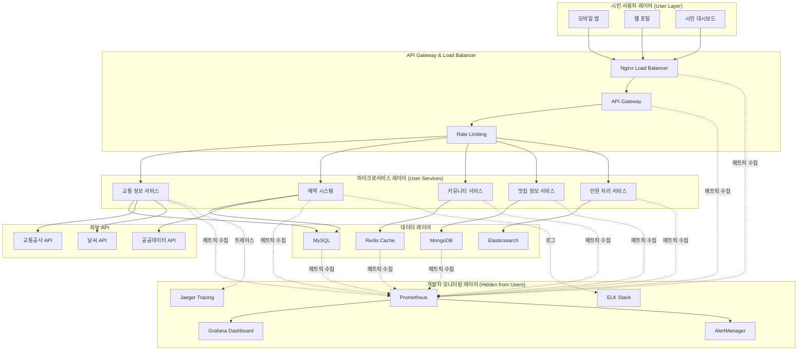
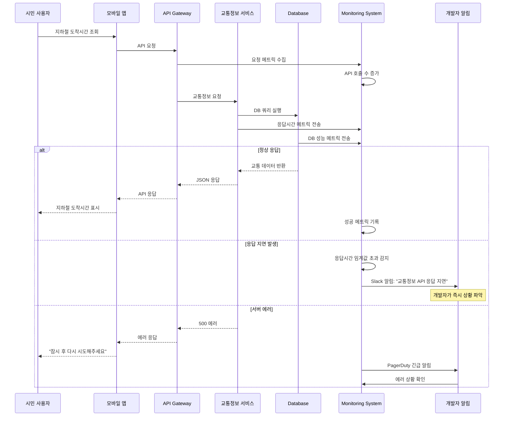
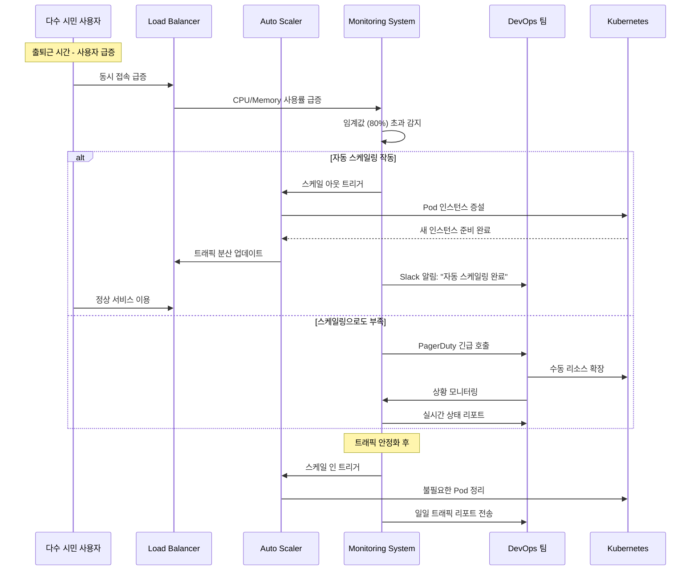
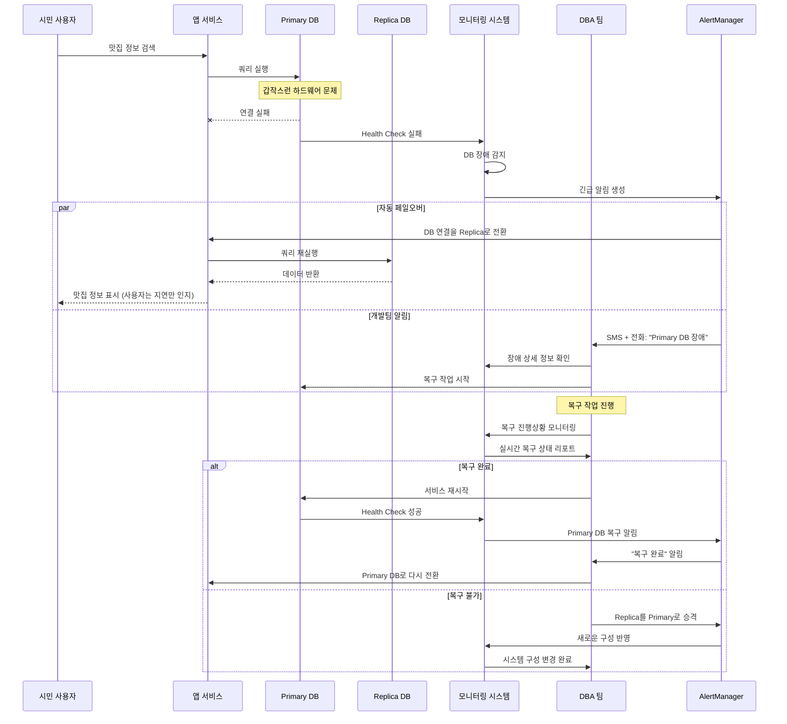
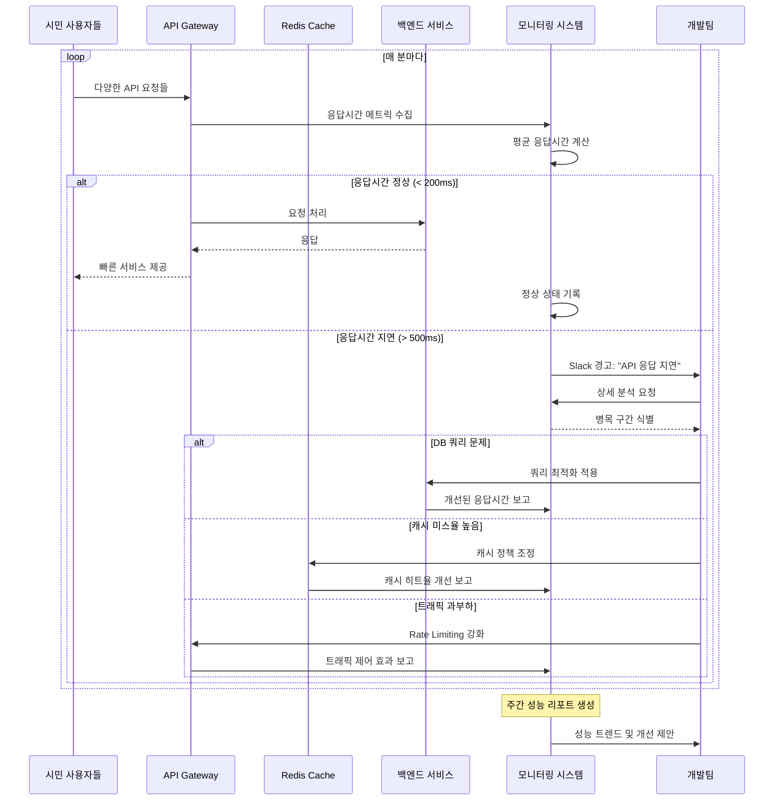

# CityLink - 시민 서비스 플랫폼 with 백엔드 통합 모니터링

## 🏙️ 서비스 개요

### 시민 대상 서비스: CityLink (시티링크)
**"우리 동네 모든 정보와 서비스를 한곳에서"**

시민들이 사용하는 통합 생활 서비스 플랫폼입니다. 교통, 날씨, 공공시설 예약, 지역 상권 정보, 커뮤니티 등을 제공하는 일반적인 시민 서비스지만, 백엔드에서는 개발팀이 정교한 통합 모니터링 시스템으로 서비스 안정성을 관리합니다.

### 시민이 보는 기능
- **실시간 교통 정보**: 지하철, 버스 도착 시간
- **공공 시설 예약**: 도서관, 체육관, 공원 시설
- **지역 맛집/상점**: 리뷰와 할인 정보
- **동네 커뮤니티**: 주민 소통 공간
- **민원 신고**: 간편한 민원 제기
- **생활 정보**: 쓰레기 배출일, 공지사항

### 개발팀이 보는 백엔드 모니터링
- **실시간 서버 상태**: CPU, 메모리, 네트워크 사용률
- **API 응답 시간**: 각 기능별 성능 지표
- **사용자 트래픽**: 실시간 접속자, 기능별 사용량
- **에러 추적**: 장애 발생 시 즉시 알림
- **데이터베이스 상태**: 쿼리 성능, 커넥션 풀

## 🏗️ 시스템 아키텍처

### 사용자 관점 vs 개발자 관점

## 🔍 시퀀스 다이어그램

### 1. 시민 사용자 서비스 이용 플로우 (+ 백엔드 모니터링)

### 2. 트래픽 급증 상황 대응 플로우

### 3. 데이터베이스 장애 감지 및 복구 플로우

### 4. API 응답 시간 모니터링 및 최적화 플로우

## 📊 모니터링 대시보드 구성

### 개발팀 전용 모니터링 대시보드

#### 1. 시스템 상태 대시보드
- **서버 리소스**: CPU, 메모리, 디스크 사용률
- **네트워크**: 인바운드/아웃바운드 트래픽
- **애플리케이션**: JVM 힙 메모리, GC 성능
- **데이터베이스**: 커넥션 풀, 쿼리 성능

#### 2. 비즈니스 메트릭 대시보드
- **사용자 활동**: 실시간 접속자, 기능별 사용량
- **서비스 품질**: API 응답시간, 에러율
- **트랜잭션**: 예약 성공률, 결제 완료율
- **지역별 통계**: 구별 사용자 분포

#### 3. 알림 관리 대시보드
- **알림 히스토리**: 발생한 모든 알림 기록
- **에스컬레이션**: 미해결 이슈 추적
- **담당자 현황**: 온콜 스케줄, 대응 시간
- **SLA 모니터링**: 서비스 레벨 목표 달성률

## 🚨 알림 시나리오

### Critical 알림 (즉시 대응)
- **서비스 다운**: 5분 이상 응답 없음
- **DB 장애**: Primary 데이터베이스 연결 실패
- **보안 이슈**: 비정상적인 접근 패턴 감지
- **결제 시스템 오류**: 결제 API 연속 실패

### Warning 알림 (30분 내 대응)
- **응답 지연**: API 응답시간 500ms 초과
- **리소스 부족**: CPU/메모리 사용률 80% 초과
- **캐시 성능 저하**: 캐시 히트율 50% 이하
- **외부 API 지연**: 공공 API 응답 지연

### Info 알림 (일일 리포트)
- **트래픽 증가**: 평소 대비 50% 이상 증가
- **신규 사용자**: 일일 신규 가입자 통계
- **기능 사용 통계**: 인기 기능 순위
- **성능 개선**: 최적화 효과 측정

## 🛠️ 기술 스택

### 시민 대상 서비스 스택
- **Frontend**: React Native (모바일), React (웹)
- **Backend**: Node.js, Python Django
- **Database**: MySQL, Redis, MongoDB
- **API**: REST API, GraphQL

### 개발팀 모니터링 스택
- **메트릭 수집**: Prometheus, Node Exporter
- **시각화**: Grafana, Custom Dashboard
- **로그 분석**: ELK Stack (Elasticsearch, Logstash, Kibana)
- **트레이싱**: Jaeger, OpenTelemetry
- **알림**: AlertManager, PagerDuty, Slack
- **컨테이너**: Kubernetes, Docker
- **CI/CD**: Jenkins, GitLab CI

## 📈 모니터링 KPI

### 시민 서비스 KPI (외부 지표)
- **사용자 만족도**: 앱스토어 평점 4.5 이상
- **월간 활성 사용자**: 10만명 이상
- **서비스 가용시간**: 99.9% 이상
- **평균 응답시간**: 200ms 이하

### 개발팀 운영 KPI (내부 지표)
- **MTTR (평균 복구 시간)**: 30분 이하
- **MTBF (평균 장애 간격)**: 720시간 이상
- **에러율**: 0.1% 이하
- **알림 정확도**: False Positive 5% 이하

## 🔮 향후 발전 계획

### 단기 (6개월)
- **AIOps 도입**: 머신러닝 기반 이상 탐지
- **자동 복구**: 일반적인 장애 상황 자동 해결
- **성능 최적화**: 캐싱 전략 고도화

### 중기 (1년)
- **예측 분석**: 장애 발생 사전 예측
- **자동 스케일링**: 트래픽 패턴 학습 기반 자동화
- **멀티 리전**: 재해 복구를 위한 다중 지역 배포

### 장기 (2년)
- **옵저버빌리티**: 메트릭, 로그, 트레이스 통합
- **카오스 엔지니어링**: 장애 내성 테스트 자동화
- **지능형 운영**: AI 기반 완전 자동화된 운영

---

*"시민들은 편리한 서비스를, 개발자들은 안정적인 운영을 - CityLink가 제공하는 두 가지 가치"*
