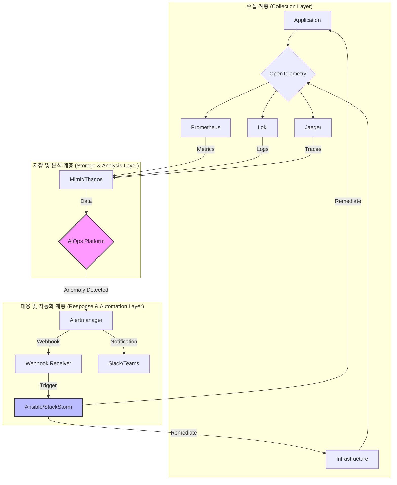

# AIOps와 Self-Healing을 중심으로 한 차세대 통합 모니터링 및 장애 대응 자동화 시스템 구축
(.with_gemini-cli)
## 목차
1. [개요](#1-개요)
2. [핵심 컨셉](#2-핵심-컨셉)
3. [기준 아키텍처](#3-기준-아키텍처)
4. [구현 기술 스택](#4-구현-기술-스택)
5. [자동화된 장애 대응 파이프라인](#5-자동화된-장애-대응-파이프라인)
6. [구현 예시 (코드)](#6-구현-예시-코드)
7. [고도화 방안](#7-고도화-방안)
8. [기대 효과](#8-기대-효과)

---

## 1. 개요

전통적인 모니터링 시스템은 장애 발생 후 사후 대응에 초점을 맞추고 있어, 복잡한 MSA 환경에서는 한계가 명확합니다. 본 문서는 최신 기술 트렌드인 **AIOps**와 **Self-Healing** 개념을 도입하여, 장애를 사전에 예측하고 사람의 개입 없이 시스템이 스스로 문제를 해결하는 **차세대 통합 모니터링 및 장애 대응 자동화 시스템** 구축 방안을 제안합니다.

- **목표**: 장애 대응 시간(MTTR)의 획기적인 단축, 운영 효율성 극대화, 시스템 안정성 강화
- **핵심 전략**: 관측 가능성(Observability)을 기반으로 데이터를 수집하고, AI를 통해 이상 징후를 분석하며, 자동화된 워크플로우를 통해 장애를 해결합니다.

## 2. 핵심 컨셉

### 2.1. 관측 가능성 (Observability)
단순히 '무엇'이 잘못되었는지 아는 것을 넘어, '왜' 문제가 발생했는지 근본 원인을 파악할 수 있도록 시스템 내부를 깊이 있게 들여다보는 것을 의미합니다.
- **Metrics**: 시스템의 상태를 나타내는 정량적인 측정값 (예: CPU 사용률, Latency)
- **Logs**: 시스템에서 발생하는 모든 이벤트에 대한 시간순 기록
- **Traces**: 단일 요청에 대한 전체 처리 과정을 추적하는 데이터

### 2.2. AIOps (AI for IT Operations)
IT 운영에 인공지능을 접목하여 대규모 데이터를 분석하고, 패턴을 학습하여 이상 징후를 예측하고, 반복적인 작업을 자동화하는 기술입니다.
- **이상 탐지 (Anomaly Detection)**: 정상 범위를 벗어나는 패턴을 자동으로 감지합니다.
- **알림 노이즈 감소**: 수많은 알림 중 진짜 중요한 문제를 필터링하고 그룹화합니다.
- **근본 원인 분석 (Root Cause Analysis)**: 여러 데이터 소스를 연관 분석하여 장애의 근본 원인을 추정합니다.

### 2.3. 자가 치유 (Self-Healing)
사람의 개입 없이 시스템이 스스로 문제를 진단하고 해결하는 능력입니다. 잘 정의된 자동화 워크플로우를 통해 구현됩니다.
- **자동화된 복구**: 서비스 재시작, 리소스 확장(Scale-out), 악성 IP 차단 등
- **선제적 대응**: 장애가 발생하기 전, 예측된 이상 징후에 따라 예방 조치를 수행합니다.

## 3. 기준 아키텍처

  <!-- 다이어그램 예시 URL -->



## 4. 구현 기술 스택

| 구분 | 역할 | 주요 기술 |
|---|---|---|
| **수집 (Collection)** | Metrics, Logs, Traces 데이터 수집 | `OpenTelemetry`, `Prometheus Exporters`, `Filebeat` |
| **저장 (Storage)** | 수집된 데이터의 대규모 저장 및 쿼리 | `Prometheus`, `Thanos`, `Mimir`, `Loki`, `Elasticsearch` |
| **시각화 (Visualization)** | 데이터 시각화 및 대시보드 | `Grafana` |
| **AIOps/분석** | 이상 탐지, 예측, 근본 원인 분석 | `TensorFlow`, `Prophet`, 상용 AIOps 솔루션 |
| **알림 (Alerting)** | 알림 규칙 정의 및 라우팅 | `Prometheus Alertmanager` |
| **자동화 (Automation)** | 장애 대응 워크플로우 실행 | `Ansible`, `StackStorm`, `Event-Driven Ansible` |
| **협업 (Collaboration)** | 알림 전파 및 제어 | `Slack`, `Microsoft Teams` |

## 5. 자동화된 장애 대응 파이프라인

### 1단계: 장애 감지 (Detection)
- **Prometheus**가 서비스의 Latency 증가, HTTP 5xx 에러 비율 증가 등 사전에 정의된 임계치를 위반하는 상황을 감지합니다.
- 또는 **AIOps 플랫폼**이 로그 패턴 분석을 통해 비정상적인 에러 로그 증가 등 이상 징후를 탐지합니다.

### 2단계: 웹훅 기반 트리거링 (Webhook Triggering)
- **Alertmanager**는 감지된 알림을 받아, 미리 설정된 `webhook_configs`에 따라 지정된 URL로 장애 정보를 담은 JSON 페이로드를 POST 요청으로 전송합니다.

### 3단계: 자동화 플레이북 실행 (Playbook Execution)
- 웹훅을 수신한 **자동화 서버(Webhook Receiver)**는 페이로드 내용을 파싱하여 장애의 심각도, 발생 위치, 종류를 파악합니다.
- 파악된 정보에 따라, 해당 장애 상황에 맞는 **Ansible 플레이북**을 실행하여 대상 서버의 서비스를 재시작하거나, 컨테이너를 재생성하는 등의 조치를 수행합니다.
- 조치 결과는 **ChatOps(Slack 등)** 채널로 전송되어 담당자가 상황을 인지할 수 있도록 합니다.

## 6. 구현 예시 (코드)

### 6.1. Alertmanager 웹훅 수신 서버 (Python/Flask)
```python
# webhook_server.py
from flask import Flask, request, jsonify
import subprocess

app = Flask(__name__)

@app.route('/webhook', methods=['POST'])
def handle_webhook():
    try:
        data = request.get_json()
        for alert in data.get('alerts', []):
            service_name = alert.get('labels', {}).get('service')
            alert_name = alert.get('labels', {}).get('alertname')

            # 특정 서비스에 High Latency 알림이 발생하면 Ansible 플레이북 실행
            if service_name == 'api-gateway' and alert_name == 'HighLatency':
                print(f"High latency detected on {service_name}. Triggering restart playbook.")
                # ansible-playbook -i hosts playbook/restart_service.yml --extra-vars "service=api-gateway"
                subprocess.run([
                    "ansible-playbook",
                    "-i", "hosts",
                    "playbooks/restart_service.yml",
                    "--extra-vars", f"service={service_name}"
                ])
        return jsonify({'status': 'success'}), 200
    except Exception as e:
        print(f"Error: {e}")
        return jsonify({'status': 'error'}), 500

if __name__ == '__main__':
    app.run(host='0.0.0.0', port=9099)
```

### 6.2. 장애 조치 Ansible 플레이북
```yaml
# playbooks/restart_service.yml
---
- name: Restart specified service
  hosts: all
  become: true
  tasks:
    - name: "Restart {{ service }} service"
      ansible.builtin.systemd:
        name: "{{ service }}"
        state: restarted
      when: service is defined
```

### 6.3. Alertmanager 설정
```yaml
# alertmanager.yml
receivers:
- name: 'automation-webhook'
  webhook_configs:
  - url: 'http://webhook-server-ip:9099/webhook'
    send_resolved: true
```

## 7. 고도화 방안

- **ChatOps 기반의 양방향 제어**: Slack에서 봇을 통해 장애 현황을 조회하고, 승인 절차를 거쳐 자동화 플레이북을 수동으로 실행하는 기능을 구현합니다.
- **Event-Driven Ansible 도입**: 웹훅 수신 서버 없이 Kafka, Prometheus 등에서 발생하는 이벤트를 직접 수신하여 플레이북을 실행하는 구조로 변경하여 응답 속도를 개선합니다.
- **Chaos Engineering 도입**: `chaostoolkit` 등의 도구를 사용하여 의도적으로 장애를 주입하고, 구축된 자동화 파이프라인이 예상대로 동작하는지 주기적으로 검증하여 시스템의 회복탄력성을 강화합니다.

## 8. 기대 효과

- **MTTR (평균 복구 시간) 단축**: 장애 발생 시 수 분 내에 자동으로 조치가 완료되어 서비스 다운타임을 최소화합니다.
- **운영 오버헤드 감소**: 24/7 수동 모니터링 및 반복적인 장애 대응 업무를 자동화하여 엔지니어의 업무 부담을 줄이고, 핵심 비즈니스 개발에 집중할 수 있도록 합니다.
- **장애 예측 및 예방**: AIOps를 통해 잠재적인 문제를 사전에 식별하고 예방 조치를 수행함으로써, 심각한 장애로 이어지는 것을 방지하고 시스템의 전반적인 안정성을 향상시킵니다.
