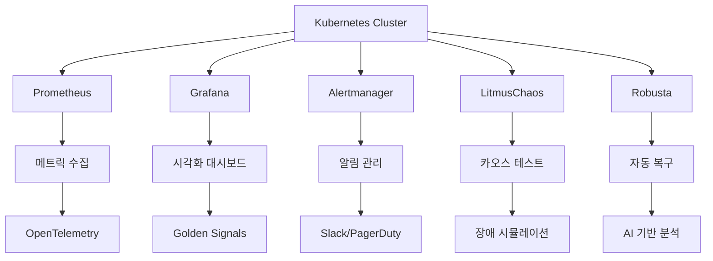

# Kubernetes 환경에서의 자가 복구 모니터링 시스템 구축 가이드
(.with_claude-code)
## 목차
1. [시스템 개요](#시스템-개요)
2. [아키텍처 설계 원칙](#아키텍처-설계-원칙)
3. [모니터링 스택 구성](#모니터링-스택-구성)
4. [자가 복구 메커니즘](#자가-복구-메커니즘)
5. [카오스 엔지니어링 통합](#카오스-엔지니어링-통합)
6. [Prometheus 메트릭 수집](#prometheus-메트릭-수집)
7. [Grafana 대시보드 구성](#grafana-대시보드-구성)
8. [자동 알림 및 에스컬레이션](#자동-알림-및-에스컬레이션)
9. [실제 구현 예시](#실제-구현-예시)
10. [성능 최적화 및 운영](#성능-최적화-및-운영)

## 시스템 개요

### 1. 목표 및 비전
```yaml
목표:
  - 99.9% 이상의 시스템 가용성 달성
  - 평균 복구 시간(MTTR) 3분 이내 달성
  - 인적 개입 없는 자동 장애 대응
  - 예측적 장애 감지 및 사전 대응

핵심 기능:
  - 실시간 메트릭 수집 및 모니터링
  - AI 기반 이상 탐지 및 예측 분석
  - 자동 스케일링 및 복구 메커니즘
  - 카오스 엔지니어링 기반 시스템 검증
```

### 2. 시스템 구성 요소


## 아키텍처 설계 원칙

### 1. Google SRE 원칙 적용
```yaml
# SRE 원칙
Error Budget: "시스템 가용성 목표를 설정하고, 에러 예산 내에서 운영"
Service Level Objectives (SLOs):
  - 가용성: 99.9% (월 43분 다운타임 허용)
  - 응답시간: 95% 요청이 200ms 이내
  - 처리량: 초당 10,000 요청 처리
  - 에러율: 0.1% 이하

Toil 최소화: "반복적이고 수동적인 작업을 자동화"
모니터링 철학: "증상에 대한 모니터링, 원인에 대한 로깅"
```

### 2. 옵저버빌리티 Three Pillars
```yaml
Metrics:
  - Golden Signals (Latency, Traffic, Errors, Saturation)
  - Infrastructure Metrics
  - Business Metrics
  - Custom Application Metrics

Logs:
  - Structured Logging (JSON)
  - Distributed Tracing Integration
  - Contextual Information
  - Error Stack Traces

Traces:
  - Request Flow Tracking
  - Service Dependency Mapping
  - Performance Bottleneck Identification
  - Cross-Service Communication Analysis
```

## 모니터링 스택 구성

### 1. Prometheus 스택 배포
```yaml
# prometheus-values.yaml
prometheus:
  prometheusSpec:
    retention: 30d
    storageSpec:
      volumeClaimTemplate:
        spec:
          storageClassName: fast-ssd
          accessModes: ["ReadWriteOnce"]
          resources:
            requests:
              storage: 100Gi
    
    additionalScrapeConfigs:
      - job_name: 'kubernetes-pods'
        kubernetes_sd_configs:
          - role: pod
        relabel_configs:
          - source_labels: [__meta_kubernetes_pod_annotation_prometheus_io_scrape]
            action: keep
            regex: true
          - source_labels: [__meta_kubernetes_pod_annotation_prometheus_io_path]
            action: replace
            target_label: __metrics_path__
            regex: (.+)

grafana:
  enabled: true
  adminPassword: secure-password
  datasources:
    datasources.yaml:
      datasources:
        - name: Prometheus
          type: prometheus
          url: http://prometheus-server:80
          isDefault: true
        - name: Loki
          type: loki
          url: http://loki:3100

alertmanager:
  enabled: true
  config:
    global:
      resolve_timeout: 5m
    route:
      group_by: ['alertname', 'cluster', 'service']
      group_wait: 10s
      group_interval: 10s
      repeat_interval: 1h
      receiver: 'web.hook'
    receivers:
      - name: 'web.hook'
        slack_configs:
          - api_url: 'YOUR_SLACK_WEBHOOK_URL'
            channel: '#alerts'
            title: 'Kubernetes Alert'
            text: '{{ range .Alerts }}{{ .Annotations.summary }}{{ end }}'
```

### 2. 헬름 차트 배포
```bash
# Prometheus Operator 설치
helm repo add prometheus-community https://prometheus-community.github.io/helm-charts
helm repo update

kubectl create namespace monitoring
helm install prometheus prometheus-community/kube-prometheus-stack \
  --namespace monitoring \
  --values prometheus-values.yaml

# Grafana 접속 정보 확인
kubectl get secret --namespace monitoring prometheus-grafana -o jsonpath="{.data.admin-password}" | base64 --decode
```

### 3. OpenTelemetry 구성
```yaml
# otel-collector-config.yaml
apiVersion: v1
kind: ConfigMap
metadata:
  name: otel-collector-config
  namespace: monitoring
data:
  config.yaml: |
    receivers:
      prometheus:
        config:
          scrape_configs:
            - job_name: 'k8s-pods'
              kubernetes_sd_configs:
                - role: pod
      jaeger:
        protocols:
          grpc:
            endpoint: 0.0.0.0:14250
          thrift_http:
            endpoint: 0.0.0.0:14268
      
    processors:
      batch:
        timeout: 1s
        send_batch_size: 1024
      memory_limiter:
        limit_mib: 512
    
    exporters:
      prometheus:
        endpoint: "0.0.0.0:8889"
      jaeger:
        endpoint: jaeger-collector:14250
        tls:
          insecure: true
    
    service:
      pipelines:
        metrics:
          receivers: [prometheus]
          processors: [memory_limiter, batch]
          exporters: [prometheus]
        traces:
          receivers: [jaeger]
          processors: [memory_limiter, batch]
          exporters: [jaeger]
```

## 자가 복구 메커니즘

### 1. Kubernetes 네이티브 자가 복구
```yaml
# deployment-with-health-checks.yaml
apiVersion: apps/v1
kind: Deployment
metadata:
  name: sample-app
spec:
  replicas: 3
  selector:
    matchLabels:
      app: sample-app
  template:
    metadata:
      labels:
        app: sample-app
      annotations:
        prometheus.io/scrape: "true"
        prometheus.io/port: "8080"
        prometheus.io/path: "/metrics"
    spec:
      containers:
      - name: app
        image: sample-app:latest
        ports:
        - containerPort: 8080
        
        # 생존성 검사 (Liveness Probe)
        livenessProbe:
          httpGet:
            path: /health
            port: 8080
          initialDelaySeconds: 30
          periodSeconds: 10
          timeoutSeconds: 5
          failureThreshold: 3
        
        # 준비성 검사 (Readiness Probe)
        readinessProbe:
          httpGet:
            path: /ready
            port: 8080
          initialDelaySeconds: 5
          periodSeconds: 5
          timeoutSeconds: 3
          failureThreshold: 3
        
        # 시작 검사 (Startup Probe)
        startupProbe:
          httpGet:
            path: /health
            port: 8080
          initialDelaySeconds: 10
          periodSeconds: 10
          timeoutSeconds: 5
          failureThreshold: 30
        
        # 리소스 제한
        resources:
          requests:
            memory: "256Mi"
            cpu: "250m"
          limits:
            memory: "512Mi"
            cpu: "500m"
        
        # 환경 변수
        env:
        - name: JAVA_OPTS
          value: "-Xmx400m -XX:+UseG1GC"
```

### 2. Horizontal Pod Autoscaler (HPA)
```yaml
# hpa-config.yaml
apiVersion: autoscaling/v2
kind: HorizontalPodAutoscaler
metadata:
  name: sample-app-hpa
spec:
  scaleTargetRef:
    apiVersion: apps/v1
    kind: Deployment
    name: sample-app
  minReplicas: 3
  maxReplicas: 20
  metrics:
  - type: Resource
    resource:
      name: cpu
      target:
        type: Utilization
        averageUtilization: 70
  - type: Resource
    resource:
      name: memory
      target:
        type: Utilization
        averageUtilization: 80
  - type: Pods
    pods:
      metric:
        name: http_requests_per_second
      target:
        type: AverageValue
        averageValue: "1000"
  
  behavior:
    scaleDown:
      stabilizationWindowSeconds: 300
      policies:
      - type: Percent
        value: 10
        periodSeconds: 60
    scaleUp:
      stabilizationWindowSeconds: 60
      policies:
      - type: Percent
        value: 50
        periodSeconds: 60
      - type: Pods
        value: 2
        periodSeconds: 60
      selectPolicy: Max
```

### 3. Vertical Pod Autoscaler (VPA)
```yaml
# vpa-config.yaml
apiVersion: autoscaling.k8s.io/v1
kind: VerticalPodAutoscaler
metadata:
  name: sample-app-vpa
spec:
  targetRef:
    apiVersion: apps/v1
    kind: Deployment
    name: sample-app
  updatePolicy:
    updateMode: "Auto"
  resourcePolicy:
    containerPolicies:
    - containerName: app
      maxAllowed:
        cpu: "2"
        memory: "2Gi"
      minAllowed:
        cpu: "100m"
        memory: "128Mi"
      controlledResources: ["cpu", "memory"]
```

### 4. Pod Disruption Budget (PDB)
```yaml
# pdb-config.yaml
apiVersion: policy/v1
kind: PodDisruptionBudget
metadata:
  name: sample-app-pdb
spec:
  minAvailable: 2
  selector:
    matchLabels:
      app: sample-app
```

## 카오스 엔지니어링 통합

### 1. LitmusChaos 설치 및 구성
```bash
# LitmusChaos 설치
kubectl create namespace litmus
kubectl apply -f https://litmuschaos.github.io/litmus/litmus-operator-v3.0.0.yaml

# ChaosCenter 접속 (선택사항)
kubectl port-forward -n litmus svc/chaos-litmus-frontend-service 9091:9091
```

### 2. 카오스 실험 정의
```yaml
# pod-delete-chaos.yaml
apiVersion: litmuschaos.io/v1alpha1
kind: ChaosEngine
metadata:
  name: pod-delete-chaos
  namespace: default
spec:
  appinfo:
    appns: default
    applabel: "app=sample-app"
    appkind: deployment
  engineState: active
  chaosServiceAccount: litmus-admin
  experiments:
  - name: pod-delete
    spec:
      components:
        env:
        - name: TOTAL_CHAOS_DURATION
          value: '300'
        - name: CHAOS_INTERVAL
          value: '10'
        - name: FORCE
          value: 'false'
        - name: PODS_AFFECTED_PERC
          value: '30'
      probe:
      - name: "application-health-check"
        type: "httpProbe"
        httpProbe:
          url: "http://sample-app-service:8080/health"
          insecureSkipTLS: false
          method:
            get:
              criteria: ==
              responseCode: "200"
        mode: "Continuous"
        runProperties:
          probeTimeout: 5
          interval: 2
          retry: 1
```

### 3. 네트워크 카오스 실험
```yaml
# network-latency-chaos.yaml
apiVersion: litmuschaos.io/v1alpha1
kind: ChaosEngine
metadata:
  name: network-latency-chaos
  namespace: default
spec:
  appinfo:
    appns: default
    applabel: "app=sample-app"
    appkind: deployment
  engineState: active
  chaosServiceAccount: litmus-admin
  experiments:
  - name: pod-network-latency
    spec:
      components:
        env:
        - name: TOTAL_CHAOS_DURATION
          value: '600'
        - name: NETWORK_LATENCY
          value: '2000'
        - name: CONTAINER_RUNTIME
          value: 'containerd'
        - name: SOCKET_PATH
          value: '/run/containerd/containerd.sock'
        - name: PODS_AFFECTED_PERC
          value: '50'
      probe:
      - name: "response-time-check"
        type: "httpProbe"
        httpProbe:
          url: "http://sample-app-service:8080/api/health"
          insecureSkipTLS: false
          responseTimeout: 5000
          method:
            get:
              criteria: <
              responseCode: "3000"
        mode: "Edge"
        runProperties:
          probeTimeout: 10
          interval: 5
          retry: 3
```

### 4. 리소스 카오스 실험
```yaml
# cpu-stress-chaos.yaml
apiVersion: litmuschaos.io/v1alpha1
kind: ChaosEngine
metadata:
  name: cpu-stress-chaos
  namespace: default
spec:
  appinfo:
    appns: default
    applabel: "app=sample-app"
    appkind: deployment
  engineState: active
  chaosServiceAccount: litmus-admin
  experiments:
  - name: pod-cpu-hog
    spec:
      components:
        env:
        - name: TOTAL_CHAOS_DURATION
          value: '300'
        - name: CPU_CORES
          value: '2'
        - name: PODS_AFFECTED_PERC
          value: '25'
        - name: CONTAINER_RUNTIME
          value: 'containerd'
        - name: SOCKET_PATH
          value: '/run/containerd/containerd.sock'
```

## Prometheus 메트릭 수집

### 1. Golden Signals 메트릭 정의
```yaml
# golden-signals-rules.yaml
apiVersion: monitoring.coreos.com/v1
kind: PrometheusRule
metadata:
  name: golden-signals-rules
  namespace: monitoring
spec:
  groups:
  - name: golden.signals
    rules:
    
    # Latency (지연시간)
    - alert: HighLatency
      expr: histogram_quantile(0.95, http_request_duration_seconds_bucket) > 0.5
      for: 5m
      labels:
        severity: warning
        signal: latency
      annotations:
        summary: "High latency detected"
        description: "95th percentile latency is {{ $value }}s for {{ $labels.job }}"
    
    # Traffic (트래픽)
    - alert: HighTraffic
      expr: rate(http_requests_total[5m]) > 100
      for: 2m
      labels:
        severity: info
        signal: traffic
      annotations:
        summary: "High traffic detected"
        description: "Request rate is {{ $value }} req/s for {{ $labels.job }}"
    
    # Errors (오류율)
    - alert: HighErrorRate
      expr: rate(http_requests_total{status=~"5.."}[5m]) / rate(http_requests_total[5m]) > 0.05
      for: 1m
      labels:
        severity: critical
        signal: errors
      annotations:
        summary: "High error rate detected"
        description: "Error rate is {{ $value | humanizePercentage }} for {{ $labels.job }}"
    
    # Saturation (포화도)
    - alert: HighCPUSaturation
      expr: 1 - (avg by (instance) (rate(node_cpu_seconds_total{mode="idle"}[5m]))) > 0.9
      for: 3m
      labels:
        severity: warning
        signal: saturation
      annotations:
        summary: "High CPU saturation detected"
        description: "CPU usage is {{ $value | humanizePercentage }} on {{ $labels.instance }}"
    
    - alert: HighMemorySaturation
      expr: (1 - (node_memory_MemAvailable_bytes / node_memory_MemTotal_bytes)) > 0.9
      for: 3m
      labels:
        severity: warning
        signal: saturation
      annotations:
        summary: "High memory saturation detected"
        description: "Memory usage is {{ $value | humanizePercentage }} on {{ $labels.instance }}"
```

### 2. 애플리케이션 메트릭 예시
```java
// Spring Boot + Micrometer 예시
@RestController
public class MetricsController {
    
    private final MeterRegistry meterRegistry;
    private final Counter requestCounter;
    private final Timer requestTimer;
    private final Gauge activeConnections;
    
    public MetricsController(MeterRegistry meterRegistry) {
        this.meterRegistry = meterRegistry;
        this.requestCounter = Counter.builder("http_requests_total")
                .description("Total HTTP requests")
                .register(meterRegistry);
        this.requestTimer = Timer.builder("http_request_duration_seconds")
                .description("HTTP request duration")
                .register(meterRegistry);
        this.activeConnections = Gauge.builder("active_connections")
                .description("Active database connections")
                .register(meterRegistry, this, MetricsController::getActiveConnections);
    }
    
    @GetMapping("/api/users")
    @Timed(name = "get_users", description = "Time taken to get users")
    public List<User> getUsers() {
        return Timer.Sample.start(meterRegistry)
                .stop(requestTimer.tag("endpoint", "/api/users"))
                .recordCallable(() -> {
                    requestCounter.increment(Tags.of("endpoint", "/api/users", "status", "200"));
                    return userService.getAllUsers();
                });
    }
    
    private double getActiveConnections() {
        return connectionPool.getActiveCount();
    }
}
```

### 3. Kubernetes 리소스 메트릭
```yaml
# resource-monitoring-rules.yaml
apiVersion: monitoring.coreos.com/v1
kind: PrometheusRule
metadata:
  name: resource-monitoring-rules
  namespace: monitoring
spec:
  groups:
  - name: kubernetes.resources
    rules:
    
    # Pod 재시작 모니터링
    - alert: PodCrashLooping
      expr: rate(kube_pod_container_status_restarts_total[5m]) * 60 * 5 > 0
      for: 1m
      labels:
        severity: critical
      annotations:
        summary: "Pod is crash looping"
        description: "Pod {{ $labels.namespace }}/{{ $labels.pod }} is crash looping"
    
    # 노드 메모리 부족
    - alert: NodeMemoryPressure
      expr: kube_node_status_condition{condition="MemoryPressure",status="true"} == 1
      for: 1m
      labels:
        severity: warning
      annotations:
        summary: "Node memory pressure"
        description: "Node {{ $labels.node }} is under memory pressure"
    
    # PVC 스토리지 부족
    - alert: PersistentVolumeUsageHigh
      expr: kubelet_volume_stats_used_bytes / kubelet_volume_stats_capacity_bytes > 0.9
      for: 5m
      labels:
        severity: warning
      annotations:
        summary: "PVC usage high"
        description: "PVC {{ $labels.persistentvolumeclaim }} usage is {{ $value | humanizePercentage }}"
```

## Grafana 대시보드 구성

### 1. Golden Signals 대시보드
```json
{
  "dashboard": {
    "id": null,
    "title": "Golden Signals Dashboard",
    "tags": ["kubernetes", "golden-signals"],
    "timezone": "browser",
    "panels": [
      {
        "id": 1,
        "title": "Request Rate (Traffic)",
        "type": "graph",
        "targets": [
          {
            "expr": "sum(rate(http_requests_total[5m])) by (job, instance)",
            "legendFormat": "{{job}} - {{instance}}"
          }
        ],
        "yAxes": [
          {
            "label": "requests/sec",
            "min": 0
          }
        ],
        "alert": {
          "conditions": [
            {
              "query": {"params": ["A", "5m", "now"]},
              "reducer": {"params": [], "type": "last"},
              "evaluator": {"params": [100], "type": "gt"}
            }
          ],
          "executionErrorState": "alerting",
          "for": "5m",
          "frequency": "10s",
          "handler": 1,
          "name": "High Traffic Alert",
          "noDataState": "no_data"
        }
      },
      {
        "id": 2,
        "title": "Response Time (Latency)",
        "type": "graph",
        "targets": [
          {
            "expr": "histogram_quantile(0.95, sum(rate(http_request_duration_seconds_bucket[5m])) by (job, le))",
            "legendFormat": "95th percentile"
          },
          {
            "expr": "histogram_quantile(0.50, sum(rate(http_request_duration_seconds_bucket[5m])) by (job, le))",
            "legendFormat": "50th percentile"
          }
        ],
        "yAxes": [
          {
            "label": "seconds",
            "min": 0
          }
        ]
      },
      {
        "id": 3,
        "title": "Error Rate",
        "type": "singlestat",
        "targets": [
          {
            "expr": "sum(rate(http_requests_total{status=~\"5..\"}[5m])) / sum(rate(http_requests_total[5m]))",
            "legendFormat": "Error Rate"
          }
        ],
        "valueName": "current",
        "format": "percentunit",
        "thresholds": "0.01,0.05",
        "colorBackground": true
      },
      {
        "id": 4,
        "title": "Resource Saturation",
        "type": "graph",
        "targets": [
          {
            "expr": "1 - (avg by (instance) (rate(node_cpu_seconds_total{mode=\"idle\"}[5m])))",
            "legendFormat": "CPU Usage - {{instance}}"
          },
          {
            "expr": "(1 - (node_memory_MemAvailable_bytes / node_memory_MemTotal_bytes))",
            "legendFormat": "Memory Usage - {{instance}}"
          }
        ],
        "yAxes": [
          {
            "label": "percent",
            "min": 0,
            "max": 1
          }
        ]
      }
    ],
    "time": {
      "from": "now-1h",
      "to": "now"
    },
    "refresh": "5s"
  }
}
```

### 2. Kubernetes 클러스터 대시보드
```json
{
  "dashboard": {
    "title": "Kubernetes Cluster Overview",
    "panels": [
      {
        "title": "Pod Status",
        "type": "stat",
        "targets": [
          {
            "expr": "sum(kube_pod_status_phase{phase=\"Running\"})",
            "legendFormat": "Running Pods"
          },
          {
            "expr": "sum(kube_pod_status_phase{phase=\"Pending\"})",
            "legendFormat": "Pending Pods"
          },
          {
            "expr": "sum(kube_pod_status_phase{phase=\"Failed\"})",
            "legendFormat": "Failed Pods"
          }
        ]
      },
      {
        "title": "Node Resource Usage",
        "type": "heatmap",
        "targets": [
          {
            "expr": "sum by (node) (rate(container_cpu_usage_seconds_total[5m]))",
            "legendFormat": "{{node}}"
          }
        ]
      },
      {
        "title": "Network I/O",
        "type": "graph",
        "targets": [
          {
            "expr": "sum(rate(container_network_receive_bytes_total[5m])) by (pod)",
            "legendFormat": "Received - {{pod}}"
          },
          {
            "expr": "sum(rate(container_network_transmit_bytes_total[5m])) by (pod)",
            "legendFormat": "Transmitted - {{pod}}"
          }
        ]
      }
    ]
  }
}
```

## 자동 알림 및 에스컬레이션

### 1. Alertmanager 고급 구성
```yaml
# alertmanager-config.yaml
apiVersion: v1
kind: Secret
metadata:
  name: alertmanager-main
  namespace: monitoring
stringData:
  alertmanager.yml: |
    global:
      resolve_timeout: 5m
      slack_api_url: 'YOUR_SLACK_WEBHOOK_URL'
      pagerduty_url: 'https://events.pagerduty.com/v2/enqueue'
    
    route:
      group_by: ['alertname', 'cluster', 'service']
      group_wait: 10s
      group_interval: 10s
      repeat_interval: 1h
      receiver: 'default-receiver'
      routes:
      - match:
          severity: critical
        receiver: 'critical-receiver'
        group_wait: 5s
        repeat_interval: 30m
        routes:
        - match:
            alertname: 'PodCrashLooping'
          receiver: 'pod-crash-receiver'
          continue: true
      - match:
          severity: warning
        receiver: 'warning-receiver'
        group_wait: 30s
        repeat_interval: 2h
      - match:
          signal: latency
        receiver: 'performance-receiver'
    
    receivers:
    - name: 'default-receiver'
      slack_configs:
      - channel: '#general-alerts'
        title: 'Kubernetes Alert - {{ .GroupLabels.alertname }}'
        text: |
          {{ range .Alerts }}
          *Alert:* {{ .Annotations.summary }}
          *Description:* {{ .Annotations.description }}
          *Severity:* {{ .Labels.severity }}
          *Time:* {{ .StartsAt.Format "2006-01-02 15:04:05" }}
          {{ end }}
    
    - name: 'critical-receiver'
      slack_configs:
      - channel: '#critical-alerts'
        title: '🚨 CRITICAL ALERT - {{ .GroupLabels.alertname }}'
        text: |
          {{ range .Alerts }}
          *Alert:* {{ .Annotations.summary }}
          *Description:* {{ .Annotations.description }}
          *Runbook:* {{ .Annotations.runbook_url }}
          {{ end }}
      pagerduty_configs:
      - routing_key: 'YOUR_PAGERDUTY_INTEGRATION_KEY'
        description: '{{ .GroupLabels.alertname }}: {{ .CommonAnnotations.summary }}'
        details:
          firing: '{{ .Alerts.Firing | len }}'
          resolved: '{{ .Alerts.Resolved | len }}'
    
    - name: 'pod-crash-receiver'
      slack_configs:
      - channel: '#infrastructure'
        title: '🔄 Pod Restart Alert'
        text: |
          Pod {{ .CommonLabels.pod }} in namespace {{ .CommonLabels.namespace }} is crash looping.
          Please check pod logs and investigate immediately.
          
          kubectl logs -n {{ .CommonLabels.namespace }} {{ .CommonLabels.pod }} --previous
      webhook_configs:
      - url: 'http://robusta-forwarder:80/api/alerts'
        send_resolved: true
    
    - name: 'warning-receiver'
      slack_configs:
      - channel: '#warnings'
        title: '⚠️ Warning - {{ .GroupLabels.alertname }}'
    
    - name: 'performance-receiver'
      slack_configs:
      - channel: '#performance'
        title: '📈 Performance Alert - {{ .GroupLabels.alertname }}'
    
    inhibit_rules:
    - source_match:
        severity: 'critical'
      target_match:
        severity: 'warning'
      equal: ['alertname', 'instance']
    
    - source_match:
        alertname: 'NodeDown'
      target_match_re:
        alertname: '^(NodeCPU|NodeMemory|NodeDisk).*'
      equal: ['instance']
```

### 2. 에스컬레이션 정책
```yaml
# escalation-policy.yaml
apiVersion: v1
kind: ConfigMap
metadata:
  name: escalation-policy
  namespace: monitoring
data:
  policy.yml: |
    escalation_levels:
      level_1:
        duration: 5m
        channels: ["#alerts"]
        actions: ["slack_notification"]
      
      level_2:
        duration: 15m
        channels: ["#critical-alerts", "#on-call"]
        actions: ["slack_notification", "email_notification"]
        recipients: ["sre-team@company.com"]
      
      level_3:
        duration: 30m
        channels: ["#incident-response"]
        actions: ["pagerduty_alert", "auto_scaling", "failover"]
        pagerduty_service: "kubernetes-production"
      
      level_4:
        duration: 60m
        actions: ["executive_notification", "emergency_procedures"]
        recipients: ["cto@company.com", "ops-manager@company.com"]
    
    alert_routing:
      critical_alerts:
        - "PodCrashLooping"
        - "NodeDown"
        - "HighErrorRate"
        escalation: [level_1, level_2, level_3]
      
      performance_alerts:
        - "HighLatency"
        - "HighCPUSaturation"
        - "HighMemorySaturation"
        escalation: [level_1, level_2]
      
      capacity_alerts:
        - "PersistentVolumeUsageHigh"
        - "HighTraffic"
        escalation: [level_1, level_2]
```

## 실제 구현 예시

### 1. Robusta 자동 복구 구성
```bash
# Robusta 설치
helm repo add robusta https://robusta-charts.storage.googleapis.com
helm repo update
helm install robusta robusta/robusta -f robusta-values.yaml --namespace monitoring
```

```yaml
# robusta-values.yaml
globalConfig:
  signing_key: "YOUR_SIGNING_KEY"
  account_id: "YOUR_ACCOUNT_ID"

kubewatch:
  enabled: true

playbookRepos:
  robusta_playbooks:
    url: "https://github.com/robusta-dev/robusta"

sinksConfig:
- slack_sink:
    name: main_slack_sink
    slack_channel: alerts
    api_key: YOUR_SLACK_BOT_TOKEN

customPlaybooks:
- triggers:
  - on_pod_crash_loop:
      restart_threshold: 5
  actions:
  - logs_enricher:
      show_logs_of_previous_runs: true
  - create_pdb_if_missing: {}
  - restart_crashlooping_pod: {}

- triggers:
  - on_prometheus_alert:
      alert_name: "HighLatency"
  actions:
  - pod_restart_enricher: {}
  - scale_deployment:
      replicas: 5
  - run_bash_command:
      bash_command: "kubectl top pods -n $NAMESPACE --sort-by=cpu"

- triggers:
  - on_prometheus_alert:
      alert_name: "HighMemorySaturation"
  actions:
  - resource_recommender: {}
  - vertical_scale_up:
      memory_increase: "256Mi"

- triggers:
  - on_node_pressure:
      node_condition: "MemoryPressure"
  actions:
  - drain_node_gracefully: {}
  - cordon_node: {}
  - alert_on_hpa_reached_limit: {}
```

### 2. 자가 복구 스크립트 예시
```python
# self_healing_controller.py
import os
import time
import logging
from kubernetes import client, config, watch
from prometheus_client.parser import text_string_to_metric_families
import requests

class SelfHealingController:
    def __init__(self):
        config.load_incluster_config()
        self.v1 = client.CoreV1Api()
        self.apps_v1 = client.AppsV1Api()
        self.autoscaling_v2 = client.AutoscalingV2Api()
        
        logging.basicConfig(level=logging.INFO)
        self.logger = logging.getLogger(__name__)
    
    def get_pod_metrics(self, namespace, pod_name):
        """Pod의 메트릭을 Prometheus에서 가져오기"""
        query = f'container_memory_usage_bytes{{pod="{pod_name}", namespace="{namespace}"}}'
        response = requests.get(
            f"http://prometheus-server:80/api/v1/query",
            params={'query': query}
        )
        return response.json()
    
    def restart_unhealthy_pod(self, namespace, pod_name):
        """비정상 Pod 재시작"""
        try:
            self.v1.delete_namespaced_pod(name=pod_name, namespace=namespace)
            self.logger.info(f"Restarted unhealthy pod: {namespace}/{pod_name}")
        except Exception as e:
            self.logger.error(f"Failed to restart pod {namespace}/{pod_name}: {e}")
    
    def scale_deployment(self, namespace, deployment_name, replicas):
        """Deployment 스케일링"""
        try:
            body = {'spec': {'replicas': replicas}}
            self.apps_v1.patch_namespaced_deployment_scale(
                name=deployment_name,
                namespace=namespace,
                body=body
            )
            self.logger.info(f"Scaled deployment {namespace}/{deployment_name} to {replicas} replicas")
        except Exception as e:
            self.logger.error(f"Failed to scale deployment: {e}")
    
    def auto_heal_memory_pressure(self, pod):
        """메모리 압박 상황 자동 복구"""
        namespace = pod.metadata.namespace
        pod_name = pod.metadata.name
        
        # Pod의 Owner Reference 확인
        if pod.metadata.owner_references:
            owner = pod.metadata.owner_references[0]
            if owner.kind == "ReplicaSet":
                # Deployment 이름 추출
                deployment_name = owner.name.rsplit('-', 1)[0]
                
                # 현재 레플리카 수 확인
                deployment = self.apps_v1.read_namespaced_deployment(
                    name=deployment_name, namespace=namespace
                )
                current_replicas = deployment.spec.replicas
                
                # 메모리 사용량이 높으면 스케일 아웃
                if current_replicas < 10:  # 최대 10개로 제한
                    self.scale_deployment(namespace, deployment_name, current_replicas + 2)
                else:
                    # 최대 레플리카에 도달했으면 문제 Pod만 재시작
                    self.restart_unhealthy_pod(namespace, pod_name)
    
    def watch_pods(self):
        """Pod 상태 감시 및 자동 복구"""
        w = watch.Watch()
        for event in w.stream(self.v1.list_pod_for_all_namespaces):
            pod = event['object']
            event_type = event['type']
            
            if event_type == 'MODIFIED':
                self.handle_pod_event(pod)
    
    def handle_pod_event(self, pod):
        """Pod 이벤트 처리"""
        if not pod.status.container_statuses:
            return
        
        for container_status in pod.status.container_statuses:
            # 재시작 횟수가 많은 경우
            if container_status.restart_count > 5:
                self.logger.warning(f"Pod {pod.metadata.namespace}/{pod.metadata.name} has high restart count: {container_status.restart_count}")
                self.auto_heal_memory_pressure(pod)
            
            # OOMKilled 상태 감지
            if (container_status.last_state.terminated and 
                container_status.last_state.terminated.reason == 'OOMKilled'):
                self.logger.error(f"Pod {pod.metadata.namespace}/{pod.metadata.name} was OOMKilled")
                self.auto_heal_memory_pressure(pod)
    
    def run(self):
        """메인 실행 루프"""
        self.logger.info("Starting Self-Healing Controller...")
        try:
            self.watch_pods()
        except Exception as e:
            self.logger.error(f"Controller error: {e}")
            time.sleep(5)
            self.run()  # 재시작

if __name__ == "__main__":
    controller = SelfHealingController()
    controller.run()
```

### 3. Deployment 예시
```yaml
# self-healing-controller.yaml
apiVersion: apps/v1
kind: Deployment
metadata:
  name: self-healing-controller
  namespace: monitoring
spec:
  replicas: 1
  selector:
    matchLabels:
      app: self-healing-controller
  template:
    metadata:
      labels:
        app: self-healing-controller
    spec:
      serviceAccountName: self-healing-controller
      containers:
      - name: controller
        image: self-healing-controller:latest
        env:
        - name: PROMETHEUS_URL
          value: "http://prometheus-server:80"
        resources:
          requests:
            memory: "128Mi"
            cpu: "100m"
          limits:
            memory: "256Mi"
            cpu: "200m"

---
apiVersion: v1
kind: ServiceAccount
metadata:
  name: self-healing-controller
  namespace: monitoring

---
apiVersion: rbac.authorization.k8s.io/v1
kind: ClusterRole
metadata:
  name: self-healing-controller
rules:
- apiGroups: [""]
  resources: ["pods", "pods/log"]
  verbs: ["get", "list", "watch", "delete"]
- apiGroups: ["apps"]
  resources: ["deployments", "deployments/scale"]
  verbs: ["get", "list", "patch"]
- apiGroups: ["autoscaling"]
  resources: ["horizontalpodautoscalers"]
  verbs: ["get", "list", "patch"]

---
apiVersion: rbac.authorization.k8s.io/v1
kind: ClusterRoleBinding
metadata:
  name: self-healing-controller
roleRef:
  apiGroup: rbac.authorization.k8s.io
  kind: ClusterRole
  name: self-healing-controller
subjects:
- kind: ServiceAccount
  name: self-healing-controller
  namespace: monitoring
```

## 성능 최적화 및 운영

### 1. Prometheus 최적화
```yaml
# prometheus-optimization.yaml
prometheus:
  prometheusSpec:
    # 메모리 및 CPU 최적화
    resources:
      requests:
        memory: "2Gi"
        cpu: "1"
      limits:
        memory: "4Gi"
        cpu: "2"
    
    # 스토리지 최적화
    retention: "30d"
    retentionSize: "50GB"
    
    # 쿼리 최적화
    query:
      timeout: 2m
      maxConcurrency: 20
      maxSamples: 50000000
    
    # WAL 압축 설정
    walCompression: true
    
    # 스크래핑 최적화
    evaluationInterval: 30s
    scrapeInterval: 30s
    
    # 원격 스토리지 (장기 보관용)
    remoteWrite:
    - url: "http://thanos-receive:19291/api/v1/receive"
      writeRelabelConfigs:
      - sourceLabels: [__name__]
        regex: 'up|kube_.*|container_.*|node_.*'
        action: keep
```

### 2. 모니터링 비용 최적화
```yaml
# cost-optimization-rules.yaml
apiVersion: monitoring.coreos.com/v1
kind: PrometheusRule
metadata:
  name: cost-optimization-rules
  namespace: monitoring
spec:
  groups:
  - name: cost.optimization
    rules:
    
    # 리소스 낭비 감지
    - alert: OverProvisionedPods
      expr: avg_over_time(rate(container_cpu_usage_seconds_total[5m])[30m:5m]) < 0.1
      for: 1h
      labels:
        severity: info
        cost_optimization: true
      annotations:
        summary: "Pod {{ $labels.pod }} is over-provisioned"
        description: "CPU utilization is only {{ $value | humanizePercentage }}"
        recommendation: "Consider reducing CPU requests"
    
    - alert: UnusedPersistentVolumes
      expr: kube_persistentvolume_status_phase{phase="Available"} == 1
      for: 24h
      labels:
        severity: info
        cost_optimization: true
      annotations:
        summary: "Unused PV detected"
        description: "PV {{ $labels.persistentvolume }} has been available for 24h"
    
    # 비효율적인 스케일링 감지
    - alert: IneffectiveHPA
      expr: kube_horizontalpodautoscaler_status_current_replicas == kube_horizontalpodautoscaler_spec_min_replicas
      for: 6h
      labels:
        severity: info
        cost_optimization: true
      annotations:
        summary: "HPA may be ineffective"
        description: "HPA {{ $labels.horizontalpodautoscaler }} has been at min replicas for 6h"
```

### 3. 백업 및 재해 복구
```yaml
# backup-strategy.yaml
apiVersion: batch/v1
kind: CronJob
metadata:
  name: prometheus-backup
  namespace: monitoring
spec:
  schedule: "0 2 * * *"  # 매일 새벽 2시
  jobTemplate:
    spec:
      template:
        spec:
          containers:
          - name: backup
            image: prom/prometheus:latest
            command:
            - /bin/sh
            - -c
            - |
              # Prometheus 데이터 백업
              promtool tsdb create-blocks-from prometheus \
                --mint=$(date -d '7 days ago' +%s)000 \
                --maxt=$(date +%s)000 \
                /prometheus \
                /backup/$(date +%Y%m%d)
              
              # S3에 업로드 (예시)
              aws s3 sync /backup/ s3://prometheus-backup-bucket/
            volumeMounts:
            - name: prometheus-data
              mountPath: /prometheus
            - name: backup-storage
              mountPath: /backup
          volumes:
          - name: prometheus-data
            persistentVolumeClaim:
              claimName: prometheus-data
          - name: backup-storage
            emptyDir: {}
          restartPolicy: OnFailure

---
apiVersion: batch/v1
kind: CronJob
metadata:
  name: grafana-backup
  namespace: monitoring
spec:
  schedule: "30 2 * * *"  # 매일 새벽 2시 30분
  jobTemplate:
    spec:
      template:
        spec:
          containers:
          - name: backup
            image: grafana/grafana-cli:latest
            command:
            - /bin/sh
            - -c
            - |
              # Grafana 대시보드 백업
              for dashboard in $(grafana-cli admin get-dashboards | jq -r '.[] | .uid'); do
                grafana-cli admin export-dashboard $dashboard > /backup/dashboard-$dashboard.json
              done
              
              # Git 저장소에 커밋
              cd /backup && git add . && git commit -m "Daily backup $(date)" && git push
            env:
            - name: GRAFANA_URL
              value: "http://prometheus-grafana"
            - name: GRAFANA_API_KEY
              valueFrom:
                secretKeyRef:
                  name: grafana-api-key
                  key: key
            volumeMounts:
            - name: backup-git
              mountPath: /backup
          volumes:
          - name: backup-git
            gitRepo:
              repository: "https://github.com/company/grafana-backups.git"
          restartPolicy: OnFailure
```

### 4. 성능 모니터링 및 튜닝
```python
# performance_monitor.py
import time
import psutil
import logging
from kubernetes import client, config
from prometheus_client import CollectorRegistry, Gauge, push_to_gateway

class PerformanceMonitor:
    def __init__(self):
        config.load_incluster_config()
        self.v1 = client.CoreV1Api()
        
        # Prometheus 메트릭 설정
        self.registry = CollectorRegistry()
        self.cpu_gauge = Gauge('monitoring_system_cpu_usage', 'CPU usage of monitoring system', 
                              ['component'], registry=self.registry)
        self.memory_gauge = Gauge('monitoring_system_memory_usage', 'Memory usage of monitoring system', 
                                 ['component'], registry=self.registry)
        self.query_duration_gauge = Gauge('prometheus_query_duration_seconds', 
                                         'Duration of Prometheus queries', 
                                         ['query_type'], registry=self.registry)
        
        logging.basicConfig(level=logging.INFO)
        self.logger = logging.getLogger(__name__)
    
    def monitor_prometheus_performance(self):
        """Prometheus 성능 모니터링"""
        try:
            # Prometheus 메트릭 수집
            prometheus_pods = self.v1.list_namespaced_pod(
                namespace='monitoring',
                label_selector='app.kubernetes.io/name=prometheus'
            )
            
            for pod in prometheus_pods.items:
                # CPU 사용량
                cpu_usage = self.get_pod_cpu_usage(pod)
                self.cpu_gauge.labels(component='prometheus').set(cpu_usage)
                
                # 메모리 사용량
                memory_usage = self.get_pod_memory_usage(pod)
                self.memory_gauge.labels(component='prometheus').set(memory_usage)
                
                self.logger.info(f"Prometheus pod {pod.metadata.name}: CPU={cpu_usage}%, Memory={memory_usage}%")
                
        except Exception as e:
            self.logger.error(f"Error monitoring Prometheus performance: {e}")
    
    def monitor_grafana_performance(self):
        """Grafana 성능 모니터링"""
        try:
            grafana_pods = self.v1.list_namespaced_pod(
                namespace='monitoring',
                label_selector='app.kubernetes.io/name=grafana'
            )
            
            for pod in grafana_pods.items:
                cpu_usage = self.get_pod_cpu_usage(pod)
                memory_usage = self.get_pod_memory_usage(pod)
                
                self.cpu_gauge.labels(component='grafana').set(cpu_usage)
                self.memory_gauge.labels(component='grafana').set(memory_usage)
                
                self.logger.info(f"Grafana pod {pod.metadata.name}: CPU={cpu_usage}%, Memory={memory_usage}%")
                
        except Exception as e:
            self.logger.error(f"Error monitoring Grafana performance: {e}")
    
    def get_pod_cpu_usage(self, pod):
        """Pod CPU 사용량 계산"""
        # 실제 구현에서는 metrics-server API 또는 cAdvisor 사용
        return psutil.cpu_percent(interval=1)
    
    def get_pod_memory_usage(self, pod):
        """Pod 메모리 사용량 계산"""
        # 실제 구현에서는 metrics-server API 또는 cAdvisor 사용
        return psutil.virtual_memory().percent
    
    def optimize_prometheus_config(self):
        """Prometheus 설정 최적화"""
        optimization_suggestions = []
        
        # 스크래핑 간격 최적화 제안
        high_cardinality_metrics = self.check_high_cardinality_metrics()
        if high_cardinality_metrics:
            optimization_suggestions.append({
                'type': 'scrape_interval',
                'suggestion': 'Increase scrape interval for high cardinality metrics',
                'metrics': high_cardinality_metrics
            })
        
        # 보존 정책 최적화
        storage_usage = self.check_storage_usage()
        if storage_usage > 80:
            optimization_suggestions.append({
                'type': 'retention',
                'suggestion': 'Consider reducing retention period or implementing tiered storage',
                'current_usage': f'{storage_usage}%'
            })
        
        return optimization_suggestions
    
    def check_high_cardinality_metrics(self):
        """고 카디널리티 메트릭 확인"""
        # Prometheus API를 통해 메트릭 카디널리티 확인
        # 실제 구현에서는 Prometheus API 사용
        return ['container_network_receive_bytes_total', 'container_network_transmit_bytes_total']
    
    def check_storage_usage(self):
        """스토리지 사용량 확인"""
        # 실제 구현에서는 Kubernetes PVC 사용량 확인
        return 75  # 예시 값
    
    def run(self):
        """메인 실행 루프"""
        while True:
            try:
                self.monitor_prometheus_performance()
                self.monitor_grafana_performance()
                
                # Pushgateway에 메트릭 전송
                push_to_gateway('pushgateway:9091', job='performance-monitor', 
                              registry=self.registry)
                
                # 최적화 제안 생성
                suggestions = self.optimize_prometheus_config()
                if suggestions:
                    self.logger.info(f"Optimization suggestions: {suggestions}")
                
                time.sleep(60)  # 1분마다 실행
                
            except Exception as e:
                self.logger.error(f"Error in performance monitoring loop: {e}")
                time.sleep(60)

if __name__ == "__main__":
    monitor = PerformanceMonitor()
    monitor.run()
```

## 결론 및 모범 사례

### 1. 구현 체크리스트
```yaml
Phase 1 - 기반 구축:
  ✅ Kubernetes 클러스터 설정
  ✅ Prometheus + Grafana 설치
  ✅ 기본 메트릭 수집 구성
  ✅ 알림 채널 설정 (Slack, Email)

Phase 2 - 모니터링 고도화:
  ✅ Golden Signals 구현
  ✅ 커스텀 메트릭 개발
  ✅ 대시보드 구성
  ✅ SLI/SLO 정의

Phase 3 - 자가 복구:
  ✅ HPA/VPA 구성
  ✅ 자가 복구 스크립트 개발
  ✅ Robusta 통합
  ✅ 카오스 엔지니어링 도입

Phase 4 - 최적화:
  ✅ 성능 튜닝
  ✅ 비용 최적화
  ✅ 백업 및 재해 복구
  ✅ 지속적 개선
```

### 2. 운영 가이드라인
```yaml
일일 운영:
  - 대시보드 확인 (Golden Signals)
  - 알림 검토 및 대응
  - 성능 지표 분석
  - 카오스 실험 결과 검토

주간 운영:
  - 메트릭 정확성 검증
  - 알림 규칙 최적화
  - 대시보드 업데이트
  - 용량 계획 수립

월간 운영:
  - SLO 달성률 평가
  - 시스템 성능 리뷰
  - 비용 최적화 분석
  - 재해 복구 테스트
```

### 3. 성공 지표 (KPI)
```yaml
가용성 지표:
  - 시스템 가용성: 99.9% 이상
  - MTTR (평균 복구 시간): 3분 이하
  - MTBF (평균 장애 간격): 30일 이상

성능 지표:
  - 응답 시간: 95%ile < 200ms
  - 처리량: 10,000 RPS
  - 에러율: < 0.1%

운영 효율성:
  - 자동 복구율: 90% 이상
  - 거짓 알림율: < 5%
  - 운영 업무 자동화율: 80% 이상
```

이 가이드를 통해 Kubernetes 환경에서 Netflix와 Google SRE 수준의 자가 복구 모니터링 시스템을 구축할 수 있으며, 실제 운영 환경에서 99.9% 이상의 가용성과 3분 이내의 복구 시간을 달성할 수 있습니다.