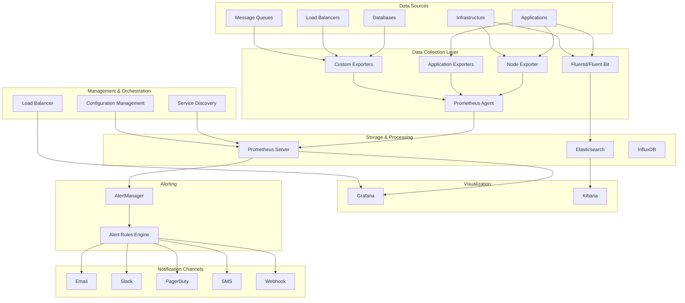
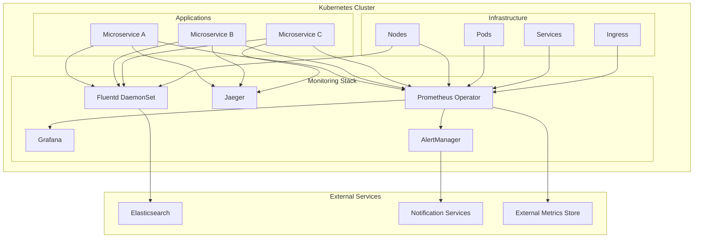
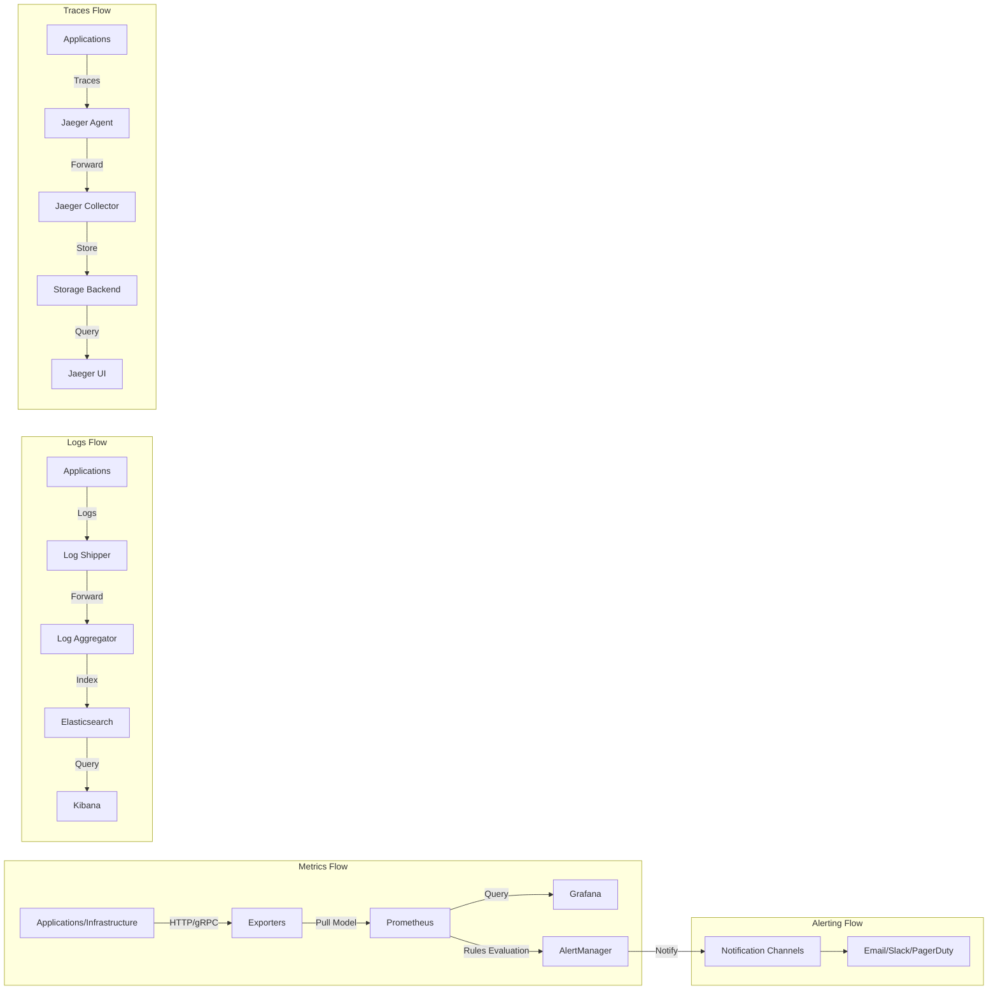
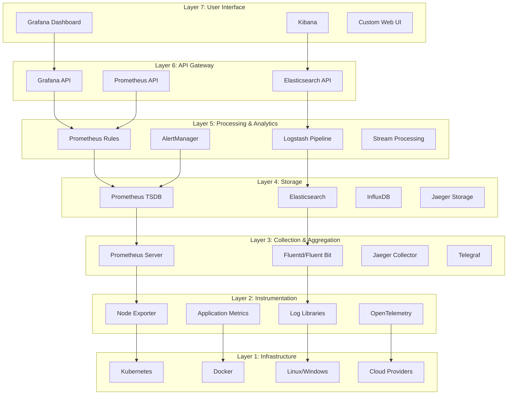

# 통합 모니터링 알림 시스템 (Integrated Monitoring & Alerting System)

## 개요
통합 모니터링 알림 시스템은 다양한 인프라스트럭처, 애플리케이션, 서비스를 실시간으로 모니터링하고 이상 상황 발생 시 자동으로 알림을 전송하는 시스템입니다.

## 시스템 아키텍처

### 일반적인 구조도 (Prometheus + Grafana + AlertManager 기반)

### 클라우드 네이티브 아키텍처 (CNCF 스택)

### 데이터 플로우 다이어그램

### 계층별 기술 스택 매핑

## 주요 구성 요소

### 1. 데이터 수집 (Data Collection)
- **메트릭 수집**: CPU, 메모리, 디스크, 네트워크 사용률
- **로그 수집**: 애플리케이션 로그, 시스템 로그, 보안 로그
- **트레이싱**: 분산 시스템에서의 요청 추적
- **이벤트 수집**: 시스템 이벤트, 사용자 행동 데이터

### 2. 데이터 저장 및 처리
- **시계열 데이터베이스**: Prometheus, InfluxDB, TimescaleDB
- **로그 저장소**: Elasticsearch, Loki
- **데이터 집계 및 분석**: 실시간 스트림 처리

### 3. 시각화 (Visualization)
- **대시보드**: Grafana, Kibana
- **실시간 차트**: 메트릭 및 로그 시각화
- **커스텀 뷰**: 팀별, 서비스별 맞춤 대시보드

### 4. 알림 시스템 (Alerting)
- **임계값 기반 알림**: 메트릭이 설정된 값을 초과할 때
- **패턴 기반 알림**: 비정상적인 패턴 감지
- **다중 채널 지원**: 이메일, SMS, Slack, PagerDuty
- **알림 라우팅**: 심각도와 담당자에 따른 알림 전달

## 핵심 기능

### 1. 실시간 모니터링
- 인프라 상태 실시간 추적
- 애플리케이션 성능 모니터링 (APM)
- 사용자 경험 모니터링 (UX)
- 비즈니스 메트릭 추적

### 2. 지능형 알림
- 노이즈 감소를 위한 알림 그룹화
- 동적 임계값 설정
- 예측적 알림 (Predictive Alerting)
- 알림 피로도 관리

### 3. 자동화 및 오케스트레이션
- 자동 복구 (Self-healing)
- 인시던트 관리 워크플로우
- 자동 스케일링 트리거
- 런북 자동 실행

### 4. 분석 및 인사이트
- 근본 원인 분석 (Root Cause Analysis)
- 성능 트렌드 분석
- 용량 계획
- SLA/SLO 추적

## 기술 스택

### 오픈소스 솔루션
- **Prometheus**: 메트릭 수집 및 저장
- **Grafana**: 시각화 및 대시보드
- **AlertManager**: 알림 관리
- **Elasticsearch**: 로그 검색 및 분석
- **Jaeger/Zipkin**: 분산 트레이싱

### 상용 솔루션
- **DataDog**: 통합 모니터링 플랫폼
- **New Relic**: APM 및 인프라 모니터링
- **Splunk**: 로그 분석 및 SIEM
- **PagerDuty**: 인시던트 관리

### 클라우드 네이티브
- **AWS CloudWatch**: AWS 리소스 모니터링
- **Azure Monitor**: Azure 환경 모니터링
- **Google Cloud Monitoring**: GCP 통합 모니터링

## 구현 고려사항

### 1. 확장성 (Scalability)
- 마이크로서비스 아키텍처 지원
- 수평적 확장 가능한 구조
- 다중 클러스터 지원

### 2. 신뢰성 (Reliability)
- 고가용성 설계
- 장애 복구 메커니즘
- 데이터 백업 및 복원

### 3. 보안 (Security)
- 데이터 암호화 (전송 중/저장 중)
- 접근 제어 및 인증
- 감사 로그

### 4. 비용 최적화
- 데이터 보존 정책
- 스토리지 계층화
- 리소스 사용량 모니터링

## 베스트 프랙티스

### 1. 모니터링 전략
- SLI/SLO 기반 모니터링
- 4 Golden Signals 추적 (지연시간, 트래픽, 오류, 포화도)
- 비즈니스 KPI와 연계

### 2. 알림 최적화
- 액션 가능한 알림만 설정
- 알림 피로도 방지
- 에스컬레이션 정책 수립

### 3. 문화 및 프로세스
- 인시던트 사후 분석 (Post-mortem)
- 온콜 순환 체계
- 지속적인 개선 문화

## 향후 발전 방향

### 1. AI/ML 통합
- 이상 탐지 (Anomaly Detection)
- 예측적 분석
- 자동화된 근본 원인 분석

### 2. 옵저버빌리티 (Observability)
- 메트릭, 로그, 트레이스 통합
- 분산 시스템 가시성 향상
- 코드 레벨 인사이트

### 3. 클라우드 네이티브 진화
- 서버리스 모니터링
- 컨테이너 중심 모니터링
- 멀티 클라우드 지원