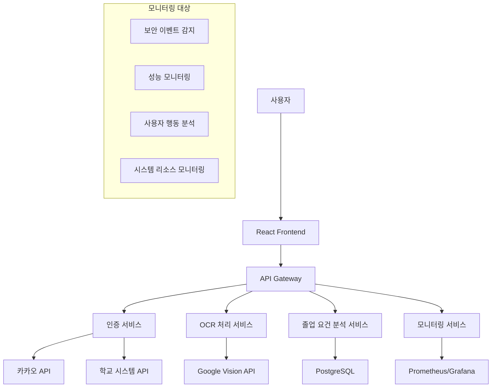

# 대학교 졸업 시뮬레이션 서비스 (Graduate Simulator)

## 1. 프로젝트 개요

### 1.1 서비스 목적
- 대학생들이 졸업 요건 충족 여부를 실시간으로 확인할 수 있는 웹 서비스
- 성적 정보를 기반으로 한 졸업 시뮬레이션 및 학습 계획 수립 지원
- OCR 기술을 활용한 성적표 자동 분석 및 데이터화

### 1.2 핵심 기능
- **카카오 소셜 로그인**: 간편한 회원가입 및 로그인
- **학번 인증 시스템**: 이름/생년월일 기반 학번 조회 및 본인 인증
- **OCR 성적 분석**: 성적표 캡처 이미지를 텍스트로 변환하여 데이터 저장
- **졸업 요건 검증**: 전공/교양/총 학점 등 졸업 요건 자동 계산
- **학습 계획 추천**: 부족한 학점 및 과목에 대한 수강 계획 제안
- **사용자 통계 기반 강의 추천**: 제공받은 데이터들로 수강하면 좋은 수업 추천
- **학과별 커리큘럼 추천**: AI가 다음 학기에 수강하면 좋은 수업 추천

## 2. 시스템 아키텍처

### 2.1 전체 구조


### 2.2 기술 스택
- **Frontend**: React.js, TypeScript, Tailwind CSS
- **Backend**: Spring Boot, Java 17, Spring Security
- **Database**: PostgreSQL, Redis (캐싱)
- **OCR**: Google Vision API, Tesseract
- **Authentication**: Kakao OAuth 2.0
- **Monitoring**: Prometheus, Grafana, ELK Stack
- **Infrastructure**: Docker, Kubernetes, AWS/GCP

## 3. 통합 모니터링 시스템 적용 방안

### 3.1 보안 모니터링 (핵심 적용 영역)

#### 3.1.1 학번 불일치 탐지 시스템
```yaml
# 모니터링 시나리오
security_monitoring:
  student_id_mismatch_detection:
    description: "로그인 학번과 OCR 추출 학번 불일치 탐지"
    triggers:
      - "동일 사용자가 5분 내 3회 이상 다른 학번으로 OCR 시도"
      - "로그인 학번과 OCR 학번이 연속 5회 불일치"
      - "동일 IP에서 10분 내 5개 이상 다른 학번 시도"
    
    alert_levels:
      warning: "3회 불일치 시 경고"
      critical: "5회 불일치 시 계정 임시 잠금"
      emergency: "동일 IP에서 대량 학번 시도 시 IP 차단"
    
    automated_responses:
      - "의심 계정 자동 잠금 (24시간)"
      - "관리자 즉시 알림 (Slack, Email)"
      - "보안 로그 상세 기록"
      - "IP 기반 접근 제한"
```

#### 3.1.2 이상 행동 패턴 탐지
```java
// 보안 모니터링 서비스 예제
@Service
public class SecurityMonitoringService {
    
    private final MeterRegistry meterRegistry;
    private final RedisTemplate<String, Object> redisTemplate;
    
    @EventListener
    public void handleOcrAttempt(OcrAttemptEvent event) {
        String userId = event.getUserId();
        String extractedStudentId = event.getExtractedStudentId();
        String actualStudentId = event.getActualStudentId();
        
        // 메트릭 수집
        Counter.builder("ocr.attempts")
            .tag("user.id", userId)
            .tag("match.status", extractedStudentId.equals(actualStudentId) ? "match" : "mismatch")
            .register(meterRegistry)
            .increment();
        
        // 불일치 패턴 감지
        if (!extractedStudentId.equals(actualStudentId)) {
            handleStudentIdMismatch(userId, extractedStudentId, actualStudentId);
        }
        
        // 반복 시도 패턴 감지
        detectRepeatedAttempts(userId, event.getClientIp());
    }
    
    private void handleStudentIdMismatch(String userId, String extracted, String actual) {
        String key = "mismatch:" + userId;
        Long attempts = redisTemplate.opsForValue().increment(key);
        redisTemplate.expire(key, Duration.ofMinutes(5));
        
        if (attempts >= 3) {
            // 경고 알림
            alertService.sendSecurityAlert(
                AlertLevel.WARNING,
                "Student ID mismatch detected",
                Map.of(
                    "userId", userId,
                    "attempts", attempts,
                    "extractedId", extracted,
                    "actualId", actual
                )
            );
        }
        
        if (attempts >= 5) {
            // 계정 잠금
            userService.lockAccount(userId, Duration.ofHours(24));
            alertService.sendSecurityAlert(AlertLevel.CRITICAL, "Account locked due to security violation");
        }
    }
}
```

### 3.2 성능 모니터링

#### 3.2.1 OCR 처리 성능 모니터링
```yaml
performance_monitoring:
  ocr_processing:
    metrics:
      - "OCR 처리 시간 (평균, P95, P99)"
      - "이미지 크기별 처리 성능"
      - "OCR 정확도 (문자 인식률)"
      - "API 호출 실패율"
    
    alerts:
      - name: "OCR 처리 지연"
        condition: "평균 처리 시간 > 10초"
        action: "자동 스케일링 트리거"
      
      - name: "OCR 정확도 저하"
        condition: "문자 인식률 < 85%"
        action: "이미지 전처리 로직 개선 알림"
```

#### 3.2.2 데이터베이스 성능 모니터링
```java
// 데이터베이스 성능 모니터링
@Component
public class DatabasePerformanceMonitor {
    
    @EventListener
    public void handleSlowQuery(SlowQueryEvent event) {
        Timer.builder("database.query.duration")
            .tag("query.type", event.getQueryType())
            .tag("table.name", event.getTableName())
            .register(meterRegistry)
            .record(event.getDuration(), TimeUnit.MILLISECONDS);
        
        // 느린 쿼리 감지 (5초 이상)
        if (event.getDuration() > 5000) {
            alertService.sendPerformanceAlert(
                "Slow query detected",
                Map.of(
                    "query", event.getQuery(),
                    "duration", event.getDuration() + "ms",
                    "table", event.getTableName()
                )
            );
        }
    }
}
```

### 3.3 사용자 행동 분석 모니터링

#### 3.3.1 사용 패턴 분석
```python
# 사용자 행동 분석 스크립트
class UserBehaviorAnalyzer:
    def __init__(self):
        self.kafka_consumer = KafkaConsumer('user-events')
        self.ml_model = self.load_anomaly_detection_model()
    
    def analyze_user_behavior(self):
        """사용자 행동 패턴 분석"""
        for message in self.kafka_consumer:
            event = json.loads(message.value)
            
            # 이상 행동 패턴 감지
            if self.detect_suspicious_behavior(event):
                self.send_security_alert(event)
            
            # 사용 통계 업데이트
            self.update_usage_statistics(event)
    
    def detect_suspicious_behavior(self, event):
        """의심스러운 행동 패턴 감지"""
        patterns = [
            self.detect_rapid_ocr_attempts(event),
            self.detect_multiple_account_access(event),
            self.detect_unusual_access_time(event),
            self.detect_geographic_anomaly(event)
        ]
        
        return any(patterns)
    
    def detect_rapid_ocr_attempts(self, event):
        """빠른 연속 OCR 시도 감지"""
        if event['event_type'] == 'ocr_attempt':
            user_id = event['user_id']
            timestamp = event['timestamp']
            
            # Redis에서 최근 시도 기록 조회
            recent_attempts = self.redis_client.zrangebyscore(
                f"ocr_attempts:{user_id}",
                timestamp - 300,  # 5분 전
                timestamp
            )
            
            # 5분 내 10회 이상 시도 시 의심
            return len(recent_attempts) >= 10
```

#### 3.3.2 졸업 요건 분석 패턴 모니터링
```yaml
graduation_analysis_monitoring:
  usage_patterns:
    - "시간대별 서비스 이용 패턴"
    - "학과별 졸업 요건 조회 빈도"
    - "성적 업데이트 주기 분석"
    - "졸업 시뮬레이션 실행 빈도"
  
  business_metrics:
    - "일일 활성 사용자 수 (DAU)"
    - "월간 활성 사용자 수 (MAU)"
    - "사용자 세션 지속 시간"
    - "기능별 사용률 분석"
```

### 3.4 시스템 리소스 모니터링

#### 3.4.1 인프라 모니터링
```yaml
# Prometheus 설정
infrastructure_monitoring:
  kubernetes_metrics:
    - "Pod CPU/Memory 사용률"
    - "Node 리소스 상태"
    - "PVC 스토리지 사용량"
    - "네트워크 트래픽"
  
  application_metrics:
    - "JVM 힙 메모리 사용률"
    - "GC 수행 시간 및 빈도"
    - "스레드 풀 상태"
    - "커넥션 풀 사용률"
  
  external_dependencies:
    - "카카오 API 응답 시간"
    - "Google Vision API 가용성"
    - "학교 시스템 API 상태"
    - "데이터베이스 연결 상태"
```

## 4. 상세 기능 명세

### 4.1 인증 및 보안 시스템
```java
// 학번 인증 서비스
@Service
public class StudentVerificationService {
    
    @Retryable(value = {Exception.class}, maxAttempts = 3)
    public StudentInfo verifyStudent(String name, LocalDate birthDate) {
        // 학교 시스템 API 호출
        StudentInfo studentInfo = schoolApiClient.getStudentInfo(name, birthDate);
        
        // 모니터링 메트릭 수집
        meterRegistry.counter("student.verification.attempts",
            "status", studentInfo != null ? "success" : "failed"
        ).increment();
        
        if (studentInfo == null) {
            throw new StudentNotFoundException("학생 정보를 찾을 수 없습니다.");
        }
        
        return studentInfo;
    }
    
    @EventListener
    public void handleVerificationFailure(StudentVerificationFailedEvent event) {
        // 연속 실패 감지
        String key = "verification_failures:" + event.getClientIp();
        Long failures = redisTemplate.opsForValue().increment(key);
        redisTemplate.expire(key, Duration.ofMinutes(10));
        
        if (failures >= 5) {
            // IP 차단 및 알림
            securityService.blockIp(event.getClientIp(), Duration.ofHours(1));
            alertService.sendSecurityAlert("Multiple verification failures from IP: " + event.getClientIp());
        }
    }
}
```

### 4.2 OCR 처리 시스템
```java
// OCR 처리 및 모니터링
@Service
public class OcrProcessingService {
    
    public GradeInfo processGradeImage(MultipartFile imageFile, String userId) {
        Timer.Sample sample = Timer.start(meterRegistry);
        
        try {
            // 이미지 전처리
            BufferedImage processedImage = imagePreprocessor.enhance(imageFile);
            
            // OCR 처리
            String extractedText = ocrEngine.extractText(processedImage);
            
            // 성적 정보 파싱
            GradeInfo gradeInfo = gradeParser.parse(extractedText);
            
            // 학번 일치 검증
            validateStudentId(gradeInfo.getStudentId(), userId);
            
            // 성공 메트릭
            meterRegistry.counter("ocr.processing.success").increment();
            
            return gradeInfo;
            
        } catch (Exception e) {
            meterRegistry.counter("ocr.processing.failed",
                "error.type", e.getClass().getSimpleName()
            ).increment();
            
            throw new OcrProcessingException("OCR 처리 중 오류가 발생했습니다.", e);
            
        } finally {
            sample.stop(Timer.builder("ocr.processing.duration")
                .tag("user.id", userId)
                .register(meterRegistry));
        }
    }
    
    private void validateStudentId(String extractedStudentId, String userId) {
        String actualStudentId = userService.getStudentId(userId);
        
        if (!extractedStudentId.equals(actualStudentId)) {
            // 보안 이벤트 발생
            applicationEventPublisher.publishEvent(
                new StudentIdMismatchEvent(userId, extractedStudentId, actualStudentId)
            );
            
            throw new SecurityException("학번이 일치하지 않습니다.");
        }
    }
}
```

### 4.3 졸업 요건 분석 시스템
```java
// 졸업 요건 분석 및 모니터링
@Service
public class GraduationAnalysisService {
    
    public GraduationStatus analyzeGraduationRequirements(String userId) {
        Timer.Sample sample = Timer.start(meterRegistry);
        
        try {
            // 사용자 성적 정보 조회
            List<Grade> grades = gradeRepository.findByUserId(userId);
            
            // 졸업 요건 계산
            GraduationRequirements requirements = getGraduationRequirements(userId);
            GraduationStatus status = calculateGraduationStatus(grades, requirements);
            
            // 분석 결과 캐싱
            cacheService.cacheGraduationStatus(userId, status);
            
            // 비즈니스 메트릭 수집
            meterRegistry.gauge("graduation.completion.rate",
                Tags.of("user.id", userId),
                status.getCompletionRate()
            );
            
            return status;
            
        } finally {
            sample.stop(Timer.builder("graduation.analysis.duration")
                .tag("user.id", userId)
                .register(meterRegistry));
        }
    }
}
```

## 5. 모니터링 대시보드 구성

### 5.1 보안 모니터링 대시보드
```yaml
security_dashboard:
  panels:
    - name: "실시간 보안 이벤트"
      metrics:
        - "학번 불일치 시도 횟수"
        - "계정 잠금 발생 건수"
        - "IP 차단 현황"
        - "의심스러운 접근 패턴"
    
    - name: "인증 실패 분석"
      metrics:
        - "시간대별 인증 실패율"
        - "지역별 접근 패턴"
        - "반복 시도 사용자 목록"
        - "API 호출 실패율"
```

### 5.2 성능 모니터링 대시보드
```yaml
performance_dashboard:
  panels:
    - name: "OCR 처리 성능"
      metrics:
        - "평균 처리 시간"
        - "처리량 (TPS)"
        - "에러율"
        - "큐 대기 시간"
    
    - name: "시스템 리소스"
      metrics:
        - "CPU/Memory 사용률"
        - "디스크 I/O"
        - "네트워크 트래픽"
        - "데이터베이스 성능"
```

### 5.3 비즈니스 메트릭 대시보드
```yaml
business_dashboard:
  panels:
    - name: "사용자 활동"
      metrics:
        - "일일/월간 활성 사용자"
        - "기능별 사용률"
        - "세션 지속 시간"
        - "사용자 만족도"
    
    - name: "졸업 분석 통계"
      metrics:
        - "학과별 졸업률"
        - "평균 졸업 소요 학기"
        - "부족 학점 분포"
        - "추천 정확도"
```

## 6. 알림 및 자동화 시스템

### 6.1 알림 규칙 설정
```yaml
# Alertmanager 설정
alerting_rules:
  - alert: SecurityViolationDetected
    expr: rate(security_violations_total[5m]) > 0.1
    for: 1m
    labels:
      severity: critical
    annotations:
      summary: "보안 위반 감지"
      description: "{{ $labels.violation_type }} 보안 위반이 감지되었습니다."
  
  - alert: OcrProcessingDelayed
    expr: histogram_quantile(0.95, rate(ocr_processing_duration_bucket[5m])) > 15
    for: 2m
    labels:
      severity: warning
    annotations:
      summary: "OCR 처리 지연"
      description: "OCR 처리 시간이 평소보다 오래 걸리고 있습니다."
  
  - alert: DatabaseConnectionPoolExhausted
    expr: hikaricp_connections_active / hikaricp_connections_max > 0.9
    for: 1m
    labels:
      severity: critical
    annotations:
      summary: "데이터베이스 연결 풀 고갈"
      description: "데이터베이스 연결 풀 사용률이 90%를 초과했습니다."
```

### 6.2 자동화 대응 시스템
```java
// 자동화 대응 서비스
@Service
public class AutomatedResponseService {
    
    @EventListener
    public void handleSecurityAlert(SecurityAlertEvent event) {
        switch (event.getSeverity()) {
            case CRITICAL:
                // 즉시 대응
                handleCriticalSecurityEvent(event);
                break;
            case WARNING:
                // 모니터링 강화
                enhanceMonitoring(event);
                break;
        }
    }
    
    private void handleCriticalSecurityEvent(SecurityAlertEvent event) {
        // 1. 관련 계정 임시 잠금
        if (event.getUserId() != null) {
            userService.lockAccount(event.getUserId(), Duration.ofHours(24));
        }
        
        // 2. IP 차단
        if (event.getClientIp() != null) {
            securityService.blockIp(event.getClientIp(), Duration.ofHours(1));
        }
        
        // 3. 관리자 즉시 알림
        notificationService.sendUrgentAlert(
            "보안 위반 감지 및 자동 대응 완료",
            event.getDetails()
        );
        
        // 4. 상세 로그 기록
        auditService.logSecurityEvent(event);
    }
}
```

## 7. 데이터 모델 및 API 설계

### 7.1 주요 엔티티
```java
// 사용자 정보
@Entity
public class User {
    @Id
    private String id;
    private String kakaoId;
    private String name;
    private LocalDate birthDate;
    private String studentId;
    private String department;
    private LocalDateTime createdAt;
    private LocalDateTime lastLoginAt;
    private AccountStatus status;
}

// 성적 정보
@Entity
public class Grade {
    @Id
    private Long id;
    private String userId;
    private String courseCode;
    private String courseName;
    private Integer credits;
    private String grade;
    private GradeType type; // 전공, 교양, 일반선택
    private String semester;
    private LocalDateTime createdAt;
}

// 졸업 요건
@Entity
public class GraduationRequirement {
    @Id
    private Long id;
    private String department;
    private Integer totalCredits;
    private Integer majorCredits;
    private Integer generalCredits;
    private Integer electiveCredits;
    private Double minimumGpa;
}
```

### 7.2 API 엔드포인트
```yaml
api_endpoints:
  authentication:
    - "POST /api/auth/kakao/login"
    - "POST /api/auth/verify-student"
    - "POST /api/auth/logout"
  
  grade_management:
    - "POST /api/grades/upload-image"
    - "GET /api/grades/list"
    - "PUT /api/grades/{id}"
    - "DELETE /api/grades/{id}"
  
  graduation_analysis:
    - "GET /api/graduation/status"
    - "GET /api/graduation/requirements"
    - "GET /api/graduation/recommendations"
  
  monitoring:
    - "GET /api/monitoring/health"
    - "GET /api/monitoring/metrics"
    - "POST /api/monitoring/alerts"
```

## 8. 배포 및 운영

### 8.1 CI/CD 파이프라인
```yaml
# GitHub Actions 워크플로우
cicd_pipeline:
  stages:
    - name: "테스트"
      steps:
        - "단위 테스트 실행"
        - "통합 테스트 실행"
        - "보안 스캔"
        - "코드 품질 검사"
    
    - name: "빌드"
      steps:
        - "Docker 이미지 빌드"
        - "이미지 보안 스캔"
        - "컨테이너 레지스트리 푸시"
    
    - name: "배포"
      steps:
        - "Kubernetes 매니페스트 적용"
        - "헬스체크 확인"
        - "모니터링 설정 적용"
        - "알림 채널 테스트"
```

### 8.2 운영 모니터링
```yaml
operational_monitoring:
  sla_targets:
    - "서비스 가용성: 99.9%"
    - "응답 시간: P95 < 2초"
    - "OCR 처리 시간: 평균 < 5초"
    - "에러율: < 0.1%"
  
  alerting_channels:
    - "Slack: 실시간 알림"
    - "Email: 중요 알림"
    - "SMS: 긴급 알림"
    - "PagerDuty: 장애 대응"
```

## 9. 보안 및 개인정보 보호

### 9.1 데이터 보안
```yaml
data_security:
  encryption:
    - "전송 중 암호화: TLS 1.3"
    - "저장 시 암호화: AES-256"
    - "개인정보 필드 암호화"
    - "데이터베이스 암호화"
  
  access_control:
    - "JWT 기반 인증"
    - "역할 기반 접근 제어 (RBAC)"
    - "API 레이트 리미팅"
    - "IP 화이트리스트"
```

### 9.2 개인정보 처리
```yaml
privacy_protection:
  data_minimization:
    - "필요 최소한의 개인정보만 수집"
    - "목적 달성 후 자동 삭제"
    - "익명화 처리"
  
  user_rights:
    - "개인정보 열람권"
    - "정정·삭제권"
    - "처리정지권"
    - "데이터 이동권"
```

## 10. 향후 확장 계획

### 10.1 기능 확장
- **AI 기반 학습 계획 추천**: 머신러닝을 활용한 개인화된 수강 계획 제안
- **다대학 지원**: 여러 대학교 시스템 연동
- **모바일 앱**: React Native 기반 모바일 애플리케이션
- **챗봇 상담**: 졸업 요건 관련 자동 상담 서비스
- **비정상 사용자 알림**: 비정상 사용자에게 카톡으로 비정상 내역 전송 및 해지를 위해 소명자료받고 계정해지 해제 

### 10.2 기술적 개선
- **마이크로서비스 아키텍처**: 서비스별 독립적 확장
- **GraphQL API**: 효율적인 데이터 조회
- **실시간 알림**: WebSocket 기반 실시간 업데이트
- **캐싱 최적화**: Redis Cluster 기반 분산 캐싱

## 11. 결론

이 프로젝트는 단순한 졸업 시뮬레이션 서비스를 넘어서, **통합 모니터링 시스템**을 적용한 **보안이 강화된 교육 서비스**입니다. 특히 다음과 같은 모니터링 요소들이 핵심적으로 적용됩니다:

### 핵심 모니터링 포인트
1. **보안 모니터링**: 학번 불일치, 반복 시도, 이상 접근 패턴 감지
2. **성능 모니터링**: OCR 처리 성능, 시스템 리소스, API 응답 시간
3. **사용자 행동 분석**: 사용 패턴, 비정상 행동, 비즈니스 메트릭
4. **자동화 대응**: 보안 위반 시 자동 차단, 성능 저하 시 자동 스케일링

이를 통해 안전하고 신뢰할 수 있는 교육 서비스를 제공하면서, 동시에 현대적인 모니터링 및 운영 기술을 실무에 적용하는 경험을 쌓을 수 있습니다.